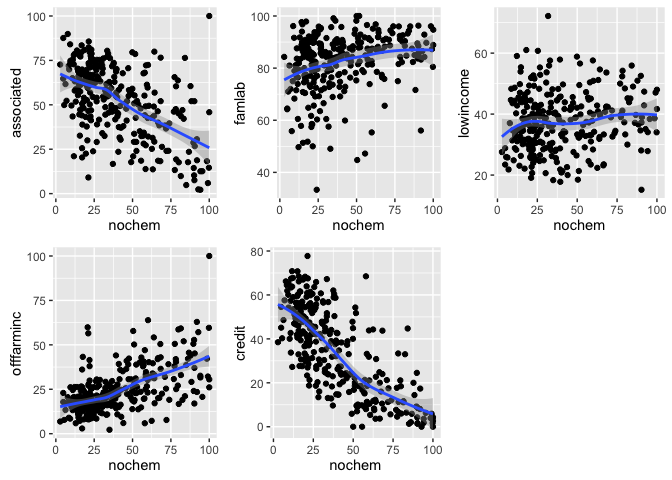

# Data checks
Jill Guerra  
January 3, 2016  

###Load packages 

```r
library(ggplot2)
```

```
## Warning: package 'ggplot2' was built under R version 3.2.3
```

```r
library(car) 
library(dplyr)
```

```
## 
## Attaching package: 'dplyr'
## 
## The following objects are masked from 'package:stats':
## 
##     filter, lag
## 
## The following objects are masked from 'package:base':
## 
##     intersect, setdiff, setequal, union
```

```r
suppressPackageStartupMessages(library(dplyr))
library(gridExtra) # for grid.arrange 
library("reshape2")
#install.packages("png")
library("png")
#install.packages("raster")
library("raster") # for arranging pngs 
```

```
## Loading required package: sp
## 
## Attaching package: 'raster'
## 
## The following object is masked from 'package:dplyr':
## 
##     select
```

```r
#install.packages("moments")
library("moments") # for skew & kurtosis
library(knitr)
```

###Import file

```r
fulldf_aei<- read.csv("~/AEI_Index/Census_data_formatted_for_R_01.06.16.csv", quote = '"', sep = ",", na.strings = c(".",""), strip.white = TRUE) # load full dataset
```

###Reshape data 

```r
# this may be useful down the road but not using at the moment. 
aei_melted <- melt(fulldf_aei) # new dataframe with melted data 
```

```
## Using X as id variables
```

```r
aes_index_var <- c("nochem", "croprot", "covercrop", "apm", "noconvtill", "directplanting", "lowtill", "drip") # drop of just index variables 
aes_socecon_var <- c("lowincome", "offfarminc", "association", "credit", "regtech", "famlab")# group of just the social and economic variables 

aei_melted2 <- aei_melted %>% 
  filter(variable %in% aes_index_var) # new dataframe with just the index variables 

(ggplot(aei_melted2, aes(x = X, y = value, colour = variable)) +
  geom_point()) # graph works. But now I really know that this graph should be showing the fitted values not the points. 
```

```
## Warning: Removed 28 rows containing missing values (geom_point).
```

 

```r
# not sure how to use this because the x variable doesn't make sense 
```

###Checking distribution 

```r
# loop to look at the distributions for all variables. It currently works. Saves all individual graphs in png files 
nm <- names(fulldf_aei[,3:18]) # calls all the AEI variables 
for (i in seq_along(nm)) {
  plots <- ggplot(fulldf_aei, aes_string(x=nm[i])) +
    geom_histogram()
  ggsave(plots,filename=paste("dist",nm[i],".png",sep=""))
 
}
```

```
## Saving 7 x 5 in image
## `stat_bin()` using `bins = 30`. Pick better value with `binwidth`.
## Saving 7 x 5 in image
## `stat_bin()` using `bins = 30`. Pick better value with `binwidth`.
## Saving 7 x 5 in image
## `stat_bin()` using `bins = 30`. Pick better value with `binwidth`.
## Saving 7 x 5 in image
## `stat_bin()` using `bins = 30`. Pick better value with `binwidth`.
## Saving 7 x 5 in image
## `stat_bin()` using `bins = 30`. Pick better value with `binwidth`.
## Saving 7 x 5 in image
## `stat_bin()` using `bins = 30`. Pick better value with `binwidth`.
## Saving 7 x 5 in image
## `stat_bin()` using `bins = 30`. Pick better value with `binwidth`.
## Saving 7 x 5 in image
## `stat_bin()` using `bins = 30`. Pick better value with `binwidth`.
## Saving 7 x 5 in image
## `stat_bin()` using `bins = 30`. Pick better value with `binwidth`.
## Saving 7 x 5 in image
## `stat_bin()` using `bins = 30`. Pick better value with `binwidth`.
## Saving 7 x 5 in image
## `stat_bin()` using `bins = 30`. Pick better value with `binwidth`.
## Saving 7 x 5 in image
## `stat_bin()` using `bins = 30`. Pick better value with `binwidth`.
## Saving 7 x 5 in image
## `stat_bin()` using `bins = 30`. Pick better value with `binwidth`.
## Saving 7 x 5 in image
## `stat_bin()` using `bins = 30`. Pick better value with `binwidth`.
## Saving 7 x 5 in image
## `stat_bin()` using `bins = 30`. Pick better value with `binwidth`.
```

```
## Warning: Removed 28 rows containing non-finite values (stat_bin).
```

```
## Saving 7 x 5 in image
## `stat_bin()` using `bins = 30`. Pick better value with `binwidth`.
```

```
## Warning: Removed 1 rows containing non-finite values (stat_bin).
```

```r
# rl = lapply(sprintf("dist",i,".png",sep=""), png::readPNG)
# gl = lapply(rl, grid::rasterGrob)
# do.call(gridExtra::grid.arrange, gl) 

#histograms
hist(fulldf_aei$nochem)
```

 

```r
hist(fulldf_aei$usefert)
```

 

```r
hist(fulldf_aei$orgcomp)
```

 

```r
hist(fulldf_aei$nitchem)
```

 

```r
hist(fulldf_aei$notnitchem)
```

 

```r
hist(fulldf_aei$manure)
```

 

```r
hist(fulldf_aei$Innoculents)
```

 

```r
hist(fulldf_aei$croprot)
```

 

```r
hist(fulldf_aei$covercrop)
```

 

```r
hist(fulldf_aei$apm)
```

 

```r
hist(fulldf_aei$noconvtill)
```

 

```r
hist(fulldf_aei$directplanting)
```

 

```r
hist(fulldf_aei$lowtill)
```

 

```r
hist(fulldf_aei$drip)
```

 

```r
hist(fulldf_aei$lowincome) 
```

 

```r
hist(fulldf_aei$offfarminc)
```

 

```r
hist(fulldf_aei$credit)
```

 

```r
hist(fulldf_aei$associated)
```

 

```r
hist(fulldf_aei$famlab)
```

 

```r
hist(fulldf_aei$regtech)
```

 

###Checking skewness & kurtosis 

```r
# create dataframe without the first two columns because they aren't numbers 
df_onlynum <- fulldf_aei[,3:(ncol(fulldf_aei))] # drop the first two columns 

#skewness 
skew <- apply(df_onlynum, 2, skewness, na.rm=TRUE) # call correct df, 2 means looking at columsn (1 would indicate looking rows), skewness is the function applied, ignore NAs 
skew # print list 

#kurtosis
kurt <- apply(df_onlynum, 2, kurtosis, na.rm=TRUE) # df, looking at columns, kurtosis is function, ignore NAs
kurt # print list
```


####Results:

- right skewed: nochem, croprot, covercrop, apm, low till, drip, offfarminc, regtech, orgcomp, notnitchem, innoculents
- left skewed: soil, assoc (sort of), famlab, usefert,nitchem
- credit, noconvtill, manure and direct planting are both very strange. 

###Check variability 

```r
variance <- apply(df_onlynum, 2, var, na.rm=TRUE)# df, looking at columns, variance is function, ignore NAs
variance
```


####Results:

- noconvtill and directplanting are incredibly varied compared to the others 
- lowinc, assoc, famlab and drip have no variance? Weird 

###Create table with values for data checks

```r
#combine values lists into a dataframe 
data_checks <- cbind(kurt, skew, variance) 
knitr::kable(data_checks)
```

                       kurt         skew     variance
---------------  ----------  -----------  -----------
nochem             2.584497    0.7715621    612.19829
usefert            3.495495   -1.0035857    368.80501
orgcomp           25.222635    3.8484109    116.89585
nitchem            9.049407   -2.3654709    293.41732
notnitchem         6.699120    1.7949141    236.08556
manure             2.060364    0.2131464    673.41939
covercrop          4.665961    1.5098648    247.92105
Innoculents       69.271838    6.8451666      7.62949
croprot            2.191291    0.5988461    319.18422
apm                5.037501    1.4421406    284.96250
noconvtill         1.668969    0.1015469    858.41713
directplanting     1.577162    0.3410214   1149.03299
lowtill            3.803961    1.0674027    302.34070
soil               3.644614   -1.0474790    466.69716
drip               6.416059    1.9786051    597.16420
famlab             4.959423   -1.2666656    122.09227
lowincome          2.927413    0.2743351     91.61513
associated         2.529620   -0.4953349    395.27501
regtech            4.294908    0.8511610    225.78770
credit             1.872079   -0.0052285    382.70974
offfarminc         7.011259    1.5168115    166.78950

```r
data_checks
```

```
##                     kurt         skew   variance
## nochem          2.584497  0.771562127  612.19829
## usefert         3.495495 -1.003585734  368.80501
## orgcomp        25.222635  3.848410853  116.89585
## nitchem         9.049407 -2.365470873  293.41732
## notnitchem      6.699119  1.794914139  236.08556
## manure          2.060364  0.213146393  673.41939
## covercrop       4.665961  1.509864790  247.92105
## Innoculents    69.271838  6.845166556    7.62949
## croprot         2.191291  0.598846053  319.18422
## apm             5.037501  1.442140577  284.96250
## noconvtill      1.668969  0.101546903  858.41713
## directplanting  1.577162  0.341021354 1149.03299
## lowtill         3.803961  1.067402741  302.34070
## soil            3.644614 -1.047479017  466.69716
## drip            6.416059  1.978605127  597.16420
## famlab          4.959423 -1.266665642  122.09227
## lowincome       2.927413  0.274335063   91.61513
## associated      2.529620 -0.495334903  395.27501
## regtech         4.294908  0.851161033  225.78770
## credit          1.872079 -0.005228475  382.70974
## offfarminc      7.011259  1.516811536  166.78950
```


###Checking Bivariate relationships of index components 

```r
# NOCHEM
a1 <- ggplot(fulldf_aei, aes(nochem, croprot)) +
  geom_point()+
  stat_smooth() 
a2 <- ggplot(fulldf_aei, aes(nochem, covercrop)) +
  geom_point() +
  stat_smooth() 
a3 <- ggplot(fulldf_aei, aes(nochem, apm)) +
  geom_point() +
  stat_smooth() 
a4 <- ggplot(fulldf_aei, aes(nochem, noconvtill)) +
  geom_point() +
  stat_smooth() 
a5 <- ggplot(fulldf_aei, aes(nochem, directplanting)) +
  geom_point() +
  stat_smooth() 
a6 <- ggplot(fulldf_aei, aes(nochem, lowtill)) +
  geom_point() +
  stat_smooth() 
a7 <- ggplot(fulldf_aei, aes(nochem, soil)) +
  geom_point() +
  stat_smooth() 
a8 <- ggplot(fulldf_aei, aes(nochem, drip)) +
  geom_point() +
  stat_smooth()
a9 <- ggplot(fulldf_aei, aes(nochem, usefert)) +
  geom_point() +
  stat_smooth()
grid.arrange(a1,a2,a3,a4,a5,a6,a7,a8,a9, ncol=3)
```

```
## Warning: Removed 28 rows containing non-finite values (stat_smooth).
```

```
## Warning: Removed 28 rows containing missing values (geom_point).
```

 

```r
# CROPROT
b1 <- ggplot(fulldf_aei, aes(croprot, covercrop)) +
  geom_point() +
  stat_smooth() 
b2 <- ggplot(fulldf_aei, aes(croprot, apm)) +
  geom_point() +
  stat_smooth() 
b3 <- ggplot(fulldf_aei, aes(croprot, noconvtill)) +
  geom_point() +
  stat_smooth() 
b4 <- ggplot(fulldf_aei, aes(croprot, directplanting)) +
  geom_point() +
  stat_smooth() 
b5 <- ggplot(fulldf_aei, aes(croprot, lowtill)) +
  geom_point() +
  stat_smooth()
b6 <- ggplot(fulldf_aei, aes(croprot, soil)) +
  geom_point() +
  stat_smooth()
b7 <- ggplot(fulldf_aei, aes(croprot, drip)) +
  geom_point() +
  stat_smooth()
b8 <- ggplot(fulldf_aei, aes(croprot, usefert)) +
  geom_point() +
  stat_smooth()
grid.arrange(b1,b2,b3,b4,b5,b6,b7,b8, ncol=3) # put all the graphs into one grid 
```

```
## Warning: Removed 28 rows containing non-finite values (stat_smooth).
```

```
## Warning: Removed 28 rows containing missing values (geom_point).
```

 

```r
# COVERCROP
c1 <- ggplot(fulldf_aei, aes(covercrop, apm)) +
  geom_point() +
  stat_smooth() 
c2 <- ggplot(fulldf_aei, aes(covercrop, noconvtill)) +
  geom_point() +
  stat_smooth() 
c3 <- ggplot(fulldf_aei, aes(covercrop, directplanting)) +
  geom_point() +
  stat_smooth() 
c4 <- ggplot(fulldf_aei, aes(covercrop, lowtill)) +
  geom_point() +
  stat_smooth()
c5 <- ggplot(fulldf_aei, aes(covercrop, soil)) +
  geom_point() +
  stat_smooth()
c6 <- ggplot(fulldf_aei, aes(covercrop, drip)) +
  geom_point() +
  stat_smooth()
c7 <- ggplot(fulldf_aei, aes(covercrop, usefert)) +
  geom_point() +
  stat_smooth()
grid.arrange(c1,c2,c3,c4,c5,c6,c7, ncol=3) # put all the graphs into one grid 
```

```
## Warning: Removed 28 rows containing non-finite values (stat_smooth).
```

```
## Warning: Removed 28 rows containing missing values (geom_point).
```

 

```r
# APM 
d1 <- ggplot(fulldf_aei, aes(apm, noconvtill)) +
  geom_point() +
  stat_smooth() 
d2 <- ggplot(fulldf_aei, aes(apm, directplanting)) +
  geom_point() +
  stat_smooth() 
d3 <- ggplot(fulldf_aei, aes(apm, lowtill)) +
  geom_point() +
  stat_smooth()
d4 <- ggplot(fulldf_aei, aes(apm, soil)) +
  geom_point() +
  stat_smooth()
d5 <- ggplot(fulldf_aei, aes(apm, drip)) +
  geom_point() +
  stat_smooth()
d6 <- ggplot(fulldf_aei, aes(apm, usefert)) +
  geom_point() +
  stat_smooth()
grid.arrange(d1,d2,d3,d4,d5,d6, ncol=3) # put all the graphs into one grid 
```

```
## Warning: Removed 28 rows containing non-finite values (stat_smooth).
```

```
## Warning: Removed 28 rows containing missing values (geom_point).
```

 

```r
#skipped a few

#DRIP
e1 <- ggplot(fulldf_aei, aes(drip, noconvtill)) +
  geom_point() +
  stat_smooth() 
e2 <- ggplot(fulldf_aei, aes(drip, directplanting)) +
  geom_point() +
  stat_smooth() 
e3 <- ggplot(fulldf_aei, aes(drip, lowtill)) +
  geom_point() +
  stat_smooth()
e4 <- ggplot(fulldf_aei, aes(drip, soil)) +
  geom_point() +
  stat_smooth()
e5 <- ggplot(fulldf_aei, aes(drip, usefert)) +
  geom_point() +
  stat_smooth()
grid.arrange(e1,e2,e3,e4,e5, ncol=3)
```

```
## Warning: Removed 28 rows containing non-finite values (stat_smooth).
```

```
## Warning: Removed 28 rows containing missing values (geom_point).
```

```
## Warning: Removed 28 rows containing non-finite values (stat_smooth).
```

```
## Warning: Removed 28 rows containing missing values (geom_point).
```

```
## Warning: Removed 28 rows containing non-finite values (stat_smooth).
```

```
## Warning: Removed 28 rows containing missing values (geom_point).
```

```
## Warning: Removed 28 rows containing non-finite values (stat_smooth).
```

```
## Warning: Removed 28 rows containing missing values (geom_point).
```

```
## Warning: Removed 28 rows containing non-finite values (stat_smooth).
```

```
## Warning: Removed 28 rows containing missing values (geom_point).
```

 


####Results: 

- very clear relatioship between nochem and fertilizer. 
- some relationship  between fert and covercrop/croprot/apm


###Checking bivariate relationships of SOCECON variables 

```r
# CREDIT
z <- ggplot(fulldf_aei, aes(credit, associated)) +
  geom_point() +
  stat_smooth() 
z1 <- ggplot(fulldf_aei, aes(credit, famlab)) +
  geom_point() +
  stat_smooth()
z2 <- ggplot(fulldf_aei, aes(credit, lowincome)) +
  geom_point() +
  stat_smooth() 
z3 <- ggplot(fulldf_aei, aes(credit, offfarminc)) +
  geom_point() +
  stat_smooth() 

grid.arrange(z, z1, z2,z3, ncol=3)
```

```
## Warning: Removed 2 rows containing non-finite values (stat_smooth).
```

```
## Warning: Removed 2 rows containing missing values (geom_point).
```

```
## Warning: Removed 1 rows containing non-finite values (stat_smooth).
```

```
## Warning: Removed 1 rows containing missing values (geom_point).
```

```
## Warning: Removed 1 rows containing non-finite values (stat_smooth).
```

```
## Warning: Removed 1 rows containing missing values (geom_point).
```

 

```r
# ASSOCIATED
y <- ggplot(fulldf_aei, aes(associated, famlab)) +
  geom_point() +
  stat_smooth()
y1 <- ggplot(fulldf_aei, aes(associated, lowincome)) +
  geom_point() +
  stat_smooth() 
y2 <- ggplot(fulldf_aei, aes(associated, offfarminc)) +
  geom_point() +
  stat_smooth() 

grid.arrange(y, y1, y2, ncol=3)
```

```
## Warning: Removed 3 rows containing non-finite values (stat_smooth).
```

```
## Warning: Removed 3 rows containing missing values (geom_point).
```

```
## Warning: Removed 3 rows containing non-finite values (stat_smooth).
```

```
## Warning: Removed 3 rows containing missing values (geom_point).
```

```
## Warning: Removed 2 rows containing non-finite values (stat_smooth).
```

```
## Warning: Removed 2 rows containing missing values (geom_point).
```

 

```r
# FAMLAB
x <- ggplot(fulldf_aei, aes(famlab, lowincome)) +
  geom_point() +
  stat_smooth() 
x1 <- ggplot(fulldf_aei, aes(famlab, offfarminc)) +
  geom_point() +
  stat_smooth() 
grid.arrange(x, x1, ncol=2)
```

```
## Warning: Removed 1 rows containing non-finite values (stat_smooth).
```

```
## Warning: Removed 1 rows containing missing values (geom_point).
```

```
## Warning: Removed 1 rows containing non-finite values (stat_smooth).
```

```
## Warning: Removed 1 rows containing missing values (geom_point).
```

 

```r
# lowincome & offfarm
(w <- ggplot(fulldf_aei, aes(lowincome, offfarminc)) +
  geom_point() +
  stat_smooth()) 
```

```
## Warning: Removed 1 rows containing non-finite values (stat_smooth).
```

```
## Warning: Removed 1 rows containing missing values (geom_point).
```

 

####Results

- credit and associated positively related 
- no other ones are related in any significant way. 

###Relationship between nochem and SOCECON variables 

```r
#NOCHEM & SE VARIABLES
n <- ggplot(fulldf_aei, aes(nochem, associated)) +
  geom_point() +
  stat_smooth() 
n1 <- ggplot(fulldf_aei, aes(nochem, famlab)) +
  geom_point() +
  stat_smooth()
n2 <- ggplot(fulldf_aei, aes(nochem, lowincome)) +
  geom_point() +
  stat_smooth() 
n3 <- ggplot(fulldf_aei, aes(nochem, offfarminc)) +
  geom_point() +
  stat_smooth() 
n4 <- ggplot(fulldf_aei, aes(nochem, credit)) +
  geom_point() +
  stat_smooth() 
grid.arrange(n, n1, n2,n3,n4, ncol=3)
```

```
## Warning: Removed 2 rows containing non-finite values (stat_smooth).
```

```
## Warning: Removed 2 rows containing missing values (geom_point).
```

```
## Warning: Removed 1 rows containing non-finite values (stat_smooth).
```

```
## Warning: Removed 1 rows containing missing values (geom_point).
```

```
## Warning: Removed 1 rows containing non-finite values (stat_smooth).
```

```
## Warning: Removed 1 rows containing missing values (geom_point).
```

 

####Results: 

- interesting negative relationship between associatedand credit and nochem. Seems to show that more associatedness and access to credit will actually lead to higher levels of agrichem useage. 

###Testing to get all on the same graph

```r
(ggplot(fulldf_aei, aes(x=X)) + 
  geom_line(aes(y=nochem, color="disp")) + 
  geom_line(aes(y=drip, color="hp")) + 
  geom_line(aes(y=lowtill, color="wt")))
```

```
## geom_path: Each group consists of only one observation. Do you need to
## adjust the group aesthetic?
## geom_path: Each group consists of only one observation. Do you need to
## adjust the group aesthetic?
## geom_path: Each group consists of only one observation. Do you need to
## adjust the group aesthetic?
```

 

```r
###### issue right now is that the group aesthetic is off. Need to change stat_bin? 
```

###Checking for leverage and outliers 


###Regression tests with NOCHEM

```r
#REGRESS NO CHEM
nochem_lm <- lm(nochem ~ offfarminc + credit + lowincome + famlab + regtech + associated, fulldf_aei, , , na.exclude) # regression testing on nochem 
#na.exclude included because otherwise I cannot add the fitted values into the dataframe because there are lost observations 
# the spaces are for two other arguments that can be specified. I don't know how else to just leave them as default. 

fulldf_aei_fit <- fulldf_aei %>% 
  mutate(nochemfit = fitted(nochem_lm)) # insert new column with the fitted values for nochem into a new dataframe that will hold the fitted values 

# plot with fitted values 
plot_nochemfit <- ggplot(fulldf_aei_fit, aes(x=associated, y = nochemfit)) +
  geom_point() +
  stat_smooth()

#plot with regular values 
plot_nochem <- ggplot(fulldf_aei, aes(associated, nochem)) +
   geom_point() +
   stat_smooth() 

grid.arrange(plot_nochemfit, plot_nochem, ncol = 2)
```

```
## Warning: Removed 3 rows containing non-finite values (stat_smooth).
```

```
## Warning: Removed 3 rows containing missing values (geom_point).
```

```
## Warning: Removed 2 rows containing non-finite values (stat_smooth).
```

```
## Warning: Removed 2 rows containing missing values (geom_point).
```

 

```r
nochem_lm
```

```
## 
## Call:
## lm(formula = nochem ~ offfarminc + credit + lowincome + famlab + 
##     regtech + associated, data = fulldf_aei, na.action = na.exclude)
## 
## Coefficients:
## (Intercept)   offfarminc       credit    lowincome       famlab  
##     28.8325       0.4196      -0.6527       0.3033       0.2678  
##     regtech   associated  
##     -0.1805      -0.1172
```
##RESOURCES 


Visualizing distribution: 
https://flowingdata.com/2012/05/15/how-to-visualize-and-compare-distributions/

Creating a looping graph 
http://www.r-bloggers.com/ggplot2-graphics-in-a-loop/

Dealing with non-normal data 
http://www.isixsigma.com/tools-templates/normality/dealing-non-normal-data-strategies-and-tools/


