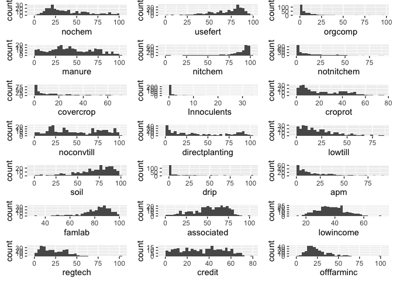

# Data checks
Jill Guerra  
January 3, 2016  

###Load packages 

```r
library(ggplot2)
```

```
## Warning: package 'ggplot2' was built under R version 3.2.3
```

```r
library(car) 
suppressPackageStartupMessages(library(dplyr))
library(gridExtra) # for grid.arrange 
library("reshape2")
#install.packages("png")
library("png")
#install.packages("raster")
library("raster") # for arranging pngs 
```

```
## Loading required package: sp
## 
## Attaching package: 'raster'
## 
## The following object is masked from 'package:dplyr':
## 
##     select
```

```r
#install.packages("moments")
library("moments") # for skew & kurtosis
library(knitr)
```

###Import file

```r
fulldf_aei<- read.csv("~/AEI_Index/Census_data_formatted_for_R_01.06.16.csv", quote = '"', sep = ",", na.strings = c(".",""), strip.white = TRUE) # load full dataset
```

###Reshape data 


###Checking distribution 
 

####Results: 


###DATA CHECKING 

```r
# create dataframe without the first two columns because they aren't numbers 
df_onlynum <- fulldf_aei[,3:(ncol(fulldf_aei))] # drop the first two columns 

#skewness 
skew <- apply(df_onlynum, 2, skewness, na.rm=TRUE) # call correct df, 2 means looking at columns (1 would indicate looking rows), skewness is the function applied, ignore NAs 

#kurtosis
kurt <- apply(df_onlynum, 2, kurtosis, na.rm=TRUE) # df, looking at columns, kurtosis is function, ignore NAs

#variance 
variance <- apply(df_onlynum, 2, var, na.rm=TRUE)# df, looking at columns, variance is function, ignore NAs

#standard deviations 
sd <- apply(df_onlynum, 2, sd, na.rm=TRUE)


# coefficient of variation 
# CV <- function(mean, sd) {
#   (sd/mean)*100
# }
```


###Create table with values for data checks

```r
#combine values lists into a dataframe 
data_checks <- cbind(kurt, skew, variance, sd) 
knitr::kable(data_checks) # nice table with all the data 
```

                       kurt         skew     variance          sd
---------------  ----------  -----------  -----------  ----------
nochem             2.584497    0.7715621    612.19829   24.742641
usefert            3.495495   -1.0035857    368.80501   19.204297
orgcomp           25.222635    3.8484109    116.89585   10.811839
nitchem            9.049407   -2.3654709    293.41732   17.129429
notnitchem         6.699120    1.7949141    236.08556   15.365076
manure             2.060364    0.2131464    673.41939   25.950326
covercrop          4.665961    1.5098648    247.92105   15.745509
Innoculents       69.271838    6.8451666      7.62949    2.762153
croprot            2.191291    0.5988461    319.18422   17.865728
apm                5.037501    1.4421406    284.96250   16.880832
noconvtill         1.668969    0.1015469    858.41713   29.298756
directplanting     1.577162    0.3410214   1149.03299   33.897389
lowtill            3.803961    1.0674027    302.34070   17.387947
soil               3.644614   -1.0474790    466.69716   21.603175
drip               6.416059    1.9786051    597.16420   24.436943
famlab             4.959423   -1.2666656    122.09227   11.049537
lowincome          2.927413    0.2743351     91.61513    9.571579
associated         2.529620   -0.4953349    395.27501   19.881524
regtech            4.294908    0.8511610    225.78770   15.026234
credit             1.872079   -0.0052285    382.70974   19.562969
offfarminc         7.011259    1.5168115    166.78950   12.914701

###Checking Bivariate relationships of index components 
      


####Results: 

- very clear relatioship between nochem and fertilizer use (likely because most fertilizer use is chemical). 
- some relationship  between fert and covercrop/croprot/apm


###Checking bivariate relationships of SOCECON variables 
    

####Results

- credit and associated positively related 
- no other ones are related in any significant way. 

###Relationship between nochem and SOCECON variables 
 


```r
t1 <- ggplot(fulldf_aei, aes(associated, nochem)) +
  geom_point() +
  stat_smooth() 
t2 <- ggplot(fulldf_aei, aes(associated, usefert)) +
  geom_point() +
  stat_smooth() 
t3 <- ggplot(fulldf_aei, aes(associated, nitchem)) +
  geom_point() +
  stat_smooth() 
t4 <- ggplot(fulldf_aei, aes(associated, notnitchem)) +
  geom_point() +
  stat_smooth() 
t5 <- ggplot(fulldf_aei, aes(associated, orgcomp)) +
  geom_point() +
  stat_smooth() 
t6 <- ggplot(fulldf_aei, aes(associated, manure)) +
  geom_point() +
  stat_smooth() 
t7 <- ggplot(fulldf_aei, aes(associated, covercrop)) +
  geom_point() +
  stat_smooth() 
t8 <- ggplot(fulldf_aei, aes(associated, croprot)) +
  geom_point() +
  stat_smooth() 
t9 <- ggplot(fulldf_aei, aes(associated, lowtill)) +
  geom_point() +
  stat_smooth() 
t10 <- ggplot(fulldf_aei, aes(associated, soil)) +
  geom_point() +
  stat_smooth() 
t11 <- ggplot(fulldf_aei, aes(associated, drip)) +
  geom_point() +
  stat_smooth() 
grid.arrange(t1,t2,t3,t4,t5,t6,t7,t8,t9,t10,t11, ncol=3)
```

```
## Warning: Removed 2 rows containing non-finite values (stat_smooth).
```

```
## Warning: Removed 2 rows containing missing values (geom_point).
```

```
## Warning: Removed 2 rows containing non-finite values (stat_smooth).
```

```
## Warning: Removed 2 rows containing missing values (geom_point).
```

```
## Warning: Removed 2 rows containing non-finite values (stat_smooth).
```

```
## Warning: Removed 2 rows containing missing values (geom_point).
```

```
## Warning: Removed 2 rows containing non-finite values (stat_smooth).
```

```
## Warning: Removed 2 rows containing missing values (geom_point).
```

```
## Warning: Removed 2 rows containing non-finite values (stat_smooth).
```

```
## Warning: Removed 2 rows containing missing values (geom_point).
```

```
## Warning: Removed 2 rows containing non-finite values (stat_smooth).
```

```
## Warning: Removed 2 rows containing missing values (geom_point).
```

```
## Warning: Removed 2 rows containing non-finite values (stat_smooth).
```

```
## Warning: Removed 2 rows containing missing values (geom_point).
```

```
## Warning: Removed 2 rows containing non-finite values (stat_smooth).
```

```
## Warning: Removed 2 rows containing missing values (geom_point).
```

```
## Warning: Removed 2 rows containing non-finite values (stat_smooth).
```

```
## Warning: Removed 2 rows containing missing values (geom_point).
```

```
## Warning: Removed 2 rows containing non-finite values (stat_smooth).
```

```
## Warning: Removed 2 rows containing missing values (geom_point).
```

```
## Warning: Removed 30 rows containing non-finite values (stat_smooth).
```

```
## Warning: Removed 30 rows containing missing values (geom_point).
```

 


```r
u1 <- ggplot(fulldf_aei, aes(famlab, nochem)) +
  geom_point() +
  stat_smooth() 
u2 <- ggplot(fulldf_aei, aes(famlab, usefert)) +
  geom_point() +
  stat_smooth() 
u3 <- ggplot(fulldf_aei, aes(famlab, nitchem)) +
  geom_point() +
  stat_smooth() 
u4 <- ggplot(fulldf_aei, aes(famlab, notnitchem)) +
  geom_point() +
  stat_smooth() 
u5 <- ggplot(fulldf_aei, aes(famlab, orgcomp)) +
  geom_point() +
  stat_smooth() 
u6 <- ggplot(fulldf_aei, aes(famlab, manure)) +
  geom_point() +
  stat_smooth() 
u7 <- ggplot(fulldf_aei, aes(famlab, covercrop)) +
  geom_point() +
  stat_smooth() 
u8 <- ggplot(fulldf_aei, aes(famlab, croprot)) +
  geom_point() +
  stat_smooth() 
u9 <- ggplot(fulldf_aei, aes(famlab, lowtill)) +
  geom_point() +
  stat_smooth() 
u10 <- ggplot(fulldf_aei, aes(famlab, soil)) +
  geom_point() +
  stat_smooth() 
u11 <- ggplot(fulldf_aei, aes(famlab, drip)) +
  geom_point() +
  stat_smooth() 
grid.arrange(u1,u2,u3,u4,u5,u6,u7,u8,u9,u10,u11, ncol=3)
```

```
## Warning: Removed 1 rows containing non-finite values (stat_smooth).
```

```
## Warning: Removed 1 rows containing missing values (geom_point).
```

```
## Warning: Removed 1 rows containing non-finite values (stat_smooth).
```

```
## Warning: Removed 1 rows containing missing values (geom_point).
```

```
## Warning: Removed 1 rows containing non-finite values (stat_smooth).
```

```
## Warning: Removed 1 rows containing missing values (geom_point).
```

```
## Warning: Removed 1 rows containing non-finite values (stat_smooth).
```

```
## Warning: Removed 1 rows containing missing values (geom_point).
```

```
## Warning: Removed 1 rows containing non-finite values (stat_smooth).
```

```
## Warning: Removed 1 rows containing missing values (geom_point).
```

```
## Warning: Removed 1 rows containing non-finite values (stat_smooth).
```

```
## Warning: Removed 1 rows containing missing values (geom_point).
```

```
## Warning: Removed 1 rows containing non-finite values (stat_smooth).
```

```
## Warning: Removed 1 rows containing missing values (geom_point).
```

```
## Warning: Removed 1 rows containing non-finite values (stat_smooth).
```

```
## Warning: Removed 1 rows containing missing values (geom_point).
```

```
## Warning: Removed 1 rows containing non-finite values (stat_smooth).
```

```
## Warning: Removed 1 rows containing missing values (geom_point).
```

```
## Warning: Removed 1 rows containing non-finite values (stat_smooth).
```

```
## Warning: Removed 1 rows containing missing values (geom_point).
```

```
## Warning: Removed 29 rows containing non-finite values (stat_smooth).
```

```
## Warning: Removed 29 rows containing missing values (geom_point).
```

 


####Results: 


- interesting negative relationship between associatedand credit and nochem. Seems to show that more associatedness and access to credit will actually lead to higher levels of agrichem useage. 

###Testing to get all on the same graph


###Regression tests with NOCHEM

```r
#REGRESS NO CHEM
nochem_lm <- lm(nochem ~ offfarminc + credit + lowincome + famlab + regtech + associated, fulldf_aei, , , na.exclude) # regression testing on nochem 
#na.exclude included because otherwise I cannot add the fitted values into the dataframe because there are lost observations 
# the spaces are for two other arguments that can be specified. I don't know how else to just leave them as default. 

nochem_lm # the regression results 
```

```
## 
## Call:
## lm(formula = nochem ~ offfarminc + credit + lowincome + famlab + 
##     regtech + associated, data = fulldf_aei, na.action = na.exclude)
## 
## Coefficients:
## (Intercept)   offfarminc       credit    lowincome       famlab  
##     28.8325       0.4196      -0.6527       0.3033       0.2678  
##     regtech   associated  
##     -0.1805      -0.1172
```

```r
fulldf_aei_fit <- fulldf_aei %>% 
  mutate(nochemfit = fitted(nochem_lm)) # insert new column with the fitted values for nochem into a new dataframe that will hold the fitted values 

#ASSOCIATED
# plot with fitted values against associated
plot_nochemfit <- ggplot(fulldf_aei_fit, aes(x=associated, y = nochemfit)) +
  geom_point() +
  stat_smooth()

#plot with regular values against assocaited
plot_nochem <- ggplot(fulldf_aei, aes(associated, nochem)) +
   geom_point() +
   stat_smooth() 

grid.arrange(plot_nochemfit, plot_nochem, ncol = 2)
```

 

```r
#CREDIT
plot_nochemfit_cred <- ggplot(fulldf_aei_fit, aes(x=credit, y = nochemfit)) +
  geom_point() +
  stat_smooth()

#plot with regular values against assocaited
plot_nochem_cred <- ggplot(fulldf_aei, aes(credit, nochem)) +
   geom_point() +
   stat_smooth() 

grid.arrange(plot_nochemfit_cred, plot_nochem_cred, ncol = 2)
```

 


##RESOURCES 


Visualizing distribution: 
https://flowingdata.com/2012/05/15/how-to-visualize-and-compare-distributions/

Creating a looping graph 
http://www.r-bloggers.com/ggplot2-graphics-in-a-loop/

Dealing with non-normal data 
http://www.isixsigma.com/tools-templates/normality/dealing-non-normal-data-strategies-and-tools/


