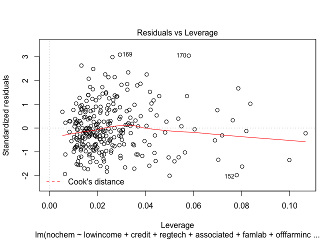
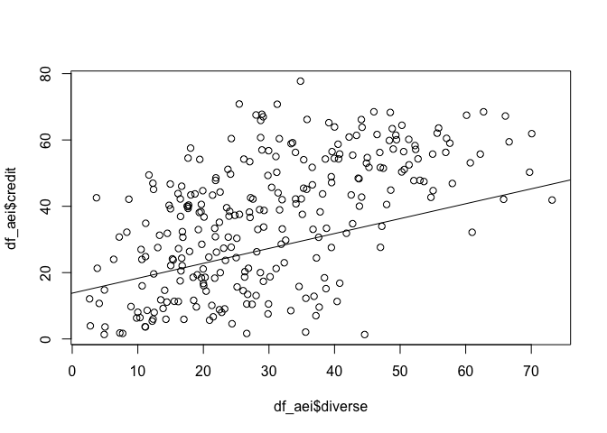

# Variable_diagnostics_04.06.16
Jill Guerra  
April 6, 2016  
This should be used to look at the histograms, spread, variability etc of individual variables 
####PART 1: LOAD
***
####PACKAGES

```r
library(ggplot2)
```

```
## Warning: package 'ggplot2' was built under R version 3.2.3
```

```r
suppressPackageStartupMessages(library(dplyr))
suppressPackageStartupMessages(library(gridExtra)) # for grid.arrange 
suppressPackageStartupMessages(library("moments")) # for skew & kurtosis
suppressPackageStartupMessages(library(knitr)) # for nice tables 
suppressPackageStartupMessages(library(ggbiplot)) # for PCA analysis 
suppressPackageStartupMessages(library(devtools)) # for PCA analysis as well, I believe 
suppressPackageStartupMessages(library(psych)) # needed for chronbach's alpha
suppressPackageStartupMessages(library(stats)) 
```

#### DATA SET UP  - This should be in every file that I am working on)

```r
rawdf_aei<- read.csv("~/AEI_Index/Census_data_formatted_for_R_04.10.16.csv", quote = '"', sep = ",", na.strings = c(".",""), strip.white = TRUE) # load full dataset
# note that this dataset was updated in a feb 22 version to only have variables that I will be working with 
```


```r
small <- c("4202453", "4202008", "4208450", "4202057", "4201950", "4206306") # these are the codes for the municipalities that have fewer than 50 farms. Names in Result_tracking Rmd. 

'%!in%' <- function(x,y)!('%in%'(x,y)) # sweet function for negating an %in% function 

# drop the municipalities that are held in the 'small' value. 
df_aei <- rawdf_aei %>% 
  filter(code %!in% small) %>% 
  droplevels()  # need to drop levels or else the new data.frame will continue to store the other factors even though they aren't being used. See Homework 5 from stats class for more about this. 

str(df_aei) # check the factor levels. It should match the #obs shown in the global environment section. If it does not then the droplevels() didn't work. 
```


```r
na_obs <- df_aei[rowSums(is.na(df_aei)) > 0,] # pulls out new data.frame with just the NA values

na_obs_names <- na_obs[,1]

df_aei <- df_aei %>% 
  filter(code %!in% na_obs_names) %>% 
  droplevels()

nlevels(df_aei$municipality) # should be 273! 
```

```
## [1] 273
```


###PART 2: DATA CHECKS
***
#####HISTOGRAMS

```r
# make sure that this is pulling from the clean dataset (no small farms, no NAs - i.e. the data that is used in the regression) 
a <- ggplot(df_aei, aes(x = covercrop)) +
 geom_histogram()
b <- ggplot(df_aei, aes(x = croprot)) +
 geom_histogram()
# c <- ggplot(df_aei, aes(x = orgcomp)) +
#  geom_histogram()
d <- ggplot(df_aei, aes(x = manure)) +
 geom_histogram()
e <- ggplot(df_aei, aes(x = apm)) +
 geom_histogram()
f <- ggplot(df_aei, aes(x = diverse)) +
 geom_histogram()
g <- ggplot(df_aei, aes(x = straw)) +
 geom_histogram()
h<- ggplot(df_aei, aes(x = nochem)) +
  geom_histogram()

p <- ggplot(df_aei, aes(x = famlab)) +
  geom_histogram()
q <- ggplot(df_aei, aes(x = associated)) +
 geom_histogram()
r <- ggplot(df_aei, aes(x = lowincome)) +
 geom_histogram()
s <- ggplot(df_aei, aes(x = regtech)) +
 geom_histogram()
t <- ggplot(df_aei, aes(x = credit)) +
 geom_histogram()
u <- ggplot(df_aei, aes(x = offfarminc)) +
  geom_histogram()

# note that the alphabet is split because I took this from a previous file 
grid.arrange(a,b,d,e,f,g,h,p,q,r,s,t,u, ncol=3)
```

```
## `stat_bin()` using `bins = 30`. Pick better value with `binwidth`.
## `stat_bin()` using `bins = 30`. Pick better value with `binwidth`.
## `stat_bin()` using `bins = 30`. Pick better value with `binwidth`.
## `stat_bin()` using `bins = 30`. Pick better value with `binwidth`.
## `stat_bin()` using `bins = 30`. Pick better value with `binwidth`.
## `stat_bin()` using `bins = 30`. Pick better value with `binwidth`.
## `stat_bin()` using `bins = 30`. Pick better value with `binwidth`.
## `stat_bin()` using `bins = 30`. Pick better value with `binwidth`.
## `stat_bin()` using `bins = 30`. Pick better value with `binwidth`.
## `stat_bin()` using `bins = 30`. Pick better value with `binwidth`.
## `stat_bin()` using `bins = 30`. Pick better value with `binwidth`.
## `stat_bin()` using `bins = 30`. Pick better value with `binwidth`.
## `stat_bin()` using `bins = 30`. Pick better value with `binwidth`.
```

 

##### SKEW, KURT, VARIANCE

```r
# create dataframe without the first two columns because they aren't numbers 
df_onlynum <- df_aei[,3:(ncol(df_aei))] # drop the first two columns 

#skewness 
skew <- apply(df_onlynum, 2, skewness, na.rm=TRUE) # call correct df, 2 means looking at columns (1 would indicate looking rows), skewness is the function applied, ignore NAs 

#kurtosis
kurt <- apply(df_onlynum, 2, kurtosis, na.rm=TRUE) # df, looking at columns, kurtosis is function, ignore NAs

#variance 
variance <- apply(df_onlynum, 2, var, na.rm=TRUE)# df, looking at columns, variance is function, ignore NAs
```


```r
#combine values lists into a dataframe 
data_checks <- cbind(kurt, skew, variance) 
knitr::kable(data_checks) # nice table with all the data 
```

                   kurt         skew    variance
-----------  ----------  -----------  ----------
orgcomp       21.457223    3.3424982    85.44581
manure         2.090965    0.2372808   659.06453
covercrop      4.380339    1.4366825   258.23556
croprot        2.098260    0.5243970   324.16451
apm            4.951492    1.4268177   290.88654
diverse        2.629490    0.4988995   228.89389
straw          1.609495    0.3879534   854.20077
famlab         4.935553   -1.2556022   120.92757
lowincome      3.028863    0.3133018    90.03783
associated     2.538223   -0.5566865   377.12591
regtech        2.350861    0.4967873   201.81722
credit         1.904571   -0.0831774   365.35663
offfarminc     4.148716    1.1096250   134.95283
nochem         2.828973    0.8777373   559.76524

##### CORRELATIONS

```r
cor(df_aei$diverse, df_aei$credit) # = 0.57
```

```
## [1] 0.5679601
```

```r
cor(df_aei$diverse, df_aei$regtech) # = NONE
```

```
## [1] 0.01363515
```

```r
cor(df_aei$diverse, df_aei$associated) # = 0.4
```

```
## [1] 0.407042
```

```r
cor(df_aei$diverse, df_aei$lowincome) # 0.52
```

```
## [1] 0.5231903
```

```r
cor(df_aei$regtech, df_aei$credit) # = 0.39
```

```
## [1] 0.3898986
```

```r
cor(df_aei$regtech, df_aei$associated) # = 0.32
```

```
## [1] 0.3157161
```

```r
cor(df_aei$credit, df_aei$associated) # = 0.67
```

```
## [1] 0.6737432
```

```r
cor(df_aei$straw, df_aei$manure) # = 0.23
```

```
## [1] 0.227467
```

```r
cor(df_aei$straw, df_aei$covercrop) # = 0.10
```

```
## [1] 0.1011808
```

```r
cor(df_aei$manure, df_aei$manure)
```

```
## [1] 1
```

```r
cor(df_aei$covercrop, df_aei$croprot)
```

```
## [1] 0.1211755
```

#### REGRESSIONS WITH INDIVIDUAL DEPENDENT VARIABLES

```r
#COVER CROP 
lm_covercrop <- lm(covercrop ~ lowincome + credit + regtech + associated, df_aei)
summary(lm_covercrop)
```

```
## 
## Call:
## lm(formula = covercrop ~ lowincome + credit + regtech + associated, 
##     data = df_aei)
## 
## Residuals:
##     Min      1Q  Median      3Q     Max 
## -23.916 -10.611  -4.086   7.812  54.708 
## 
## Coefficients:
##             Estimate Std. Error t value Pr(>|t|)   
## (Intercept) 16.11100    5.45742   2.952  0.00344 **
## lowincome   -0.19195    0.11416  -1.681  0.09386 . 
## credit       0.16327    0.07303   2.236  0.02619 * 
## regtech      0.22049    0.08112   2.718  0.00699 **
## associated  -0.10970    0.06578  -1.668  0.09653 . 
## ---
## Signif. codes:  0 '***' 0.001 '**' 0.01 '*' 0.05 '.' 0.1 ' ' 1
## 
## Residual standard error: 15.41 on 268 degrees of freedom
## Multiple R-squared:  0.09384,	Adjusted R-squared:  0.08032 
## F-statistic: 6.939 on 4 and 268 DF,  p-value: 2.5e-05
```

```r
plot(lm_covercrop)
```

    

```r
#CROP ROTATION 
lm_croprot <- lm(croprot ~ lowincome + credit + regtech + associated, df_aei)
summary(lm_croprot)
```

```
## 
## Call:
## lm(formula = croprot ~ lowincome + credit + regtech + associated, 
##     data = df_aei)
## 
## Residuals:
##     Min      1Q  Median      3Q     Max 
## -30.874  -7.688  -0.005   8.332  32.689 
## 
## Coefficients:
##              Estimate Std. Error t value Pr(>|t|)    
## (Intercept) -13.60719    4.38672  -3.102  0.00213 ** 
## lowincome     0.29268    0.09176   3.189  0.00159 ** 
## credit        0.58702    0.05870  10.000  < 2e-16 ***
## regtech       0.00552    0.06520   0.085  0.93260    
## associated    0.08715    0.05287   1.648  0.10047    
## ---
## Signif. codes:  0 '***' 0.001 '**' 0.01 '*' 0.05 '.' 0.1 ' ' 1
## 
## Residual standard error: 12.39 on 268 degrees of freedom
## Multiple R-squared:  0.5336,	Adjusted R-squared:  0.5266 
## F-statistic: 76.65 on 4 and 268 DF,  p-value: < 2.2e-16
```

```r
plot(lm_croprot)
```

    

```r
#MANURE
lm_manure <- lm(manure ~ lowincome + credit + regtech + associated, df_aei)
summary(lm_manure)
```

```
## 
## Call:
## lm(formula = manure ~ lowincome + credit + regtech + associated, 
##     data = df_aei)
## 
## Residuals:
##     Min      1Q  Median      3Q     Max 
## -48.419 -18.137  -3.022  20.975  61.058 
## 
## Coefficients:
##             Estimate Std. Error t value Pr(>|t|)    
## (Intercept) 51.57144    9.01643   5.720 2.85e-08 ***
## lowincome   -0.37334    0.18861  -1.979   0.0488 *  
## credit       0.08569    0.12065   0.710   0.4782    
## regtech      0.06058    0.13402   0.452   0.6516    
## associated   0.04284    0.10867   0.394   0.6938    
## ---
## Signif. codes:  0 '***' 0.001 '**' 0.01 '*' 0.05 '.' 0.1 ' ' 1
## 
## Residual standard error: 25.46 on 268 degrees of freedom
## Multiple R-squared:  0.03086,	Adjusted R-squared:  0.0164 
## F-statistic: 2.133 on 4 and 268 DF,  p-value: 0.07697
```

```r
plot(lm_manure)
```

    

```r
#APM
lm_apm <- lm(apm ~ lowincome + credit + regtech + associated, df_aei)
summary(lm_apm)
```

```
## 
## Call:
## lm(formula = apm ~ lowincome + credit + regtech + associated, 
##     data = df_aei)
## 
## Residuals:
##     Min      1Q  Median      3Q     Max 
## -26.300 -10.973  -4.134   7.851  70.596 
## 
## Coefficients:
##             Estimate Std. Error t value Pr(>|t|)  
## (Intercept) -5.36690    5.69315  -0.943   0.3467  
## lowincome    0.21408    0.11909   1.798   0.0734 .
## credit       0.13575    0.07618   1.782   0.0759 .
## regtech      0.19116    0.08462   2.259   0.0247 *
## associated   0.10484    0.06862   1.528   0.1277  
## ---
## Signif. codes:  0 '***' 0.001 '**' 0.01 '*' 0.05 '.' 0.1 ' ' 1
## 
## Residual standard error: 16.08 on 268 degrees of freedom
## Multiple R-squared:  0.1246,	Adjusted R-squared:  0.1115 
## F-statistic: 9.533 on 4 and 268 DF,  p-value: 3.207e-07
```

```r
plot(lm_apm)
```

    

```r
#DIVERSE
lm_diverse <- lm(diverse ~ lowincome + credit + regtech + associated, df_aei)
summary(lm_diverse)
```

```
## 
## Call:
## lm(formula = diverse ~ lowincome + credit + regtech + associated, 
##     data = df_aei)
## 
## Residuals:
##     Min      1Q  Median      3Q     Max 
## -29.731  -6.882  -1.934   6.636  33.752 
## 
## Coefficients:
##              Estimate Std. Error t value Pr(>|t|)    
## (Intercept) -13.30476    3.73066  -3.566 0.000429 ***
## lowincome     0.70674    0.07804   9.056  < 2e-16 ***
## credit        0.33097    0.04992   6.630 1.84e-10 ***
## regtech      -0.03011    0.05545  -0.543 0.587529    
## associated    0.10193    0.04496   2.267 0.024190 *  
## ---
## Signif. codes:  0 '***' 0.001 '**' 0.01 '*' 0.05 '.' 0.1 ' ' 1
## 
## Residual standard error: 10.53 on 268 degrees of freedom
## Multiple R-squared:  0.5223,	Adjusted R-squared:  0.5151 
## F-statistic: 73.25 on 4 and 268 DF,  p-value: < 2.2e-16
```

```r
plot(lm_diverse)
```

    

```r
#STRAW
lm_straw <- lm(straw ~ lowincome + credit + regtech + associated, df_aei)
summary(lm_straw)
```

```
## 
## Call:
## lm(formula = straw ~ lowincome + credit + regtech + associated, 
##     data = df_aei)
## 
## Residuals:
##    Min     1Q Median     3Q    Max 
## -48.36 -11.93   0.60  10.20  53.41 
## 
## Coefficients:
##               Estimate Std. Error t value Pr(>|t|)    
## (Intercept) -22.944185   6.160878  -3.724 0.000239 ***
## lowincome     0.382806   0.128879   2.970 0.003245 ** 
## credit        1.192727   0.082441  14.468  < 2e-16 ***
## regtech      -0.043589   0.091572  -0.476 0.634458    
## associated    0.008183   0.074255   0.110 0.912337    
## ---
## Signif. codes:  0 '***' 0.001 '**' 0.01 '*' 0.05 '.' 0.1 ' ' 1
## 
## Residual standard error: 17.4 on 268 degrees of freedom
## Multiple R-squared:  0.6509,	Adjusted R-squared:  0.6457 
## F-statistic: 124.9 on 4 and 268 DF,  p-value: < 2.2e-16
```

```r
plot(lm_straw)
```

    

```r
# NOCHEM 
lm_nochem <- lm(nochem ~ lowincome + credit + regtech + associated + famlab + offfarminc, df_aei)
summary(lm_nochem)
```

```
## 
## Call:
## lm(formula = nochem ~ lowincome + credit + regtech + associated + 
##     famlab + offfarminc, data = df_aei)
## 
## Residuals:
##     Min      1Q  Median      3Q     Max 
## -28.502 -10.322  -1.438   9.698  44.340 
## 
## Coefficients:
##             Estimate Std. Error t value Pr(>|t|)    
## (Intercept) 28.84370    9.40089   3.068  0.00238 ** 
## lowincome    0.30144    0.10951   2.753  0.00632 ** 
## credit      -0.62495    0.07347  -8.506 1.32e-15 ***
## regtech     -0.17607    0.07834  -2.248  0.02543 *  
## associated  -0.12794    0.06232  -2.053  0.04105 *  
## famlab       0.26363    0.08388   3.143  0.00186 ** 
## offfarminc   0.39732    0.09290   4.277 2.65e-05 ***
## ---
## Signif. codes:  0 '***' 0.001 '**' 0.01 '*' 0.05 '.' 0.1 ' ' 1
## 
## Residual standard error: 14.57 on 266 degrees of freedom
## Multiple R-squared:  0.629,	Adjusted R-squared:  0.6206 
## F-statistic: 75.16 on 6 and 266 DF,  p-value: < 2.2e-16
```

```r
plot(lm_nochem)
```

    

Thes correlations point to a moderate-strong relationship between production diversity and credit. So diversification of acitivies requires some access to credit 


```r
plot(df_aei$diverse, df_aei$credit)
abline(lm(df_aei$diverse~df_aei$credit))
```

 

