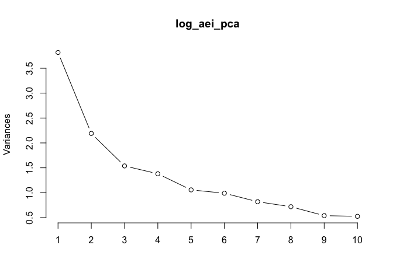

# Principle Component Analysis & Index Construction
Jill Guerra  
January 5, 2016  
###Load packages 

```r
library(ggplot2)
```

```
## Warning: package 'ggplot2' was built under R version 3.2.3
```

```r
library(car) 
library(dplyr)
```

```
## 
## Attaching package: 'dplyr'
## 
## The following objects are masked from 'package:stats':
## 
##     filter, lag
## 
## The following objects are masked from 'package:base':
## 
##     intersect, setdiff, setequal, union
```

```r
suppressPackageStartupMessages(library(dplyr))
library(gridExtra)
library("reshape2")
```

###Import file - Remember to change depending on what you need. 

```r
fulldf_aei<- read.csv("~/AEI_Index/Census_data_formatted_for_R_01.06.16.csv", quote = '"', sep = ",", na.strings = c(".",""), strip.white = TRUE) # load full dataset
```

###Principle Component Analysis 
ALL FROM HERE: http://www.r-bloggers.com/computing-and-visualizing-pca-in-r/

```r
# omit NAs for this part 
fulldf_aei_omit <- na.omit(fulldf_aei)

# log transform 
log_aei <- log(fulldf_aei_omit [, 3:11]) # columns with the AE components going to be used in the index 
aei_species <- fulldf_aei_omit [, 2] # this calls the categorical variable 
# calls the Municipality names.

#Change all infinite values to NAs 
log_aei<- do.call(data.frame,lapply(log_aei, function(x) replace(x, is.infinite(x),NA))) # this changes all of them! 
# ok but the data.frame doesn't have any other things in there (only the components)

#Drop all observations with NA (thus all the infinite because they were previously changed to NA)
log_aei <- na.omit(log_aei) # shows that it is changed from 262 levels down to 139 levels. 

#Apply PCA - scale. = TRUE is highly advisable, but default is FALSE. 
log_aei_pca <- prcomp(log_aei, 
                      na.action = na.exclude, 
                      center = TRUE,               
                      scale. = TRUE) 
print(log_aei_pca)
```

```
## Standard deviations:
## [1] 1.5790778 1.2275414 1.0570444 1.0119148 0.9166124 0.8710375 0.7253431
## [8] 0.6618513 0.5434027
## 
## Rotation:
##                      PC1          PC2         PC3         PC4         PC5
## nochem       0.530818738 -0.037448388  0.13093157 -0.05488913  0.24215491
## usefert     -0.541498601 -0.056042562  0.02965147  0.12704830 -0.14604586
## orgcomp      0.225050386 -0.200075695 -0.20439107  0.65439491 -0.50557360
## nitchem     -0.391382208  0.439574457  0.17036788  0.03199318 -0.09821554
## notnitchem  -0.001628226  0.307999942 -0.47977355  0.54774750  0.45263052
## manure      -0.080469093 -0.644900039 -0.15930925 -0.05607775  0.39137838
## covercrop   -0.304902015 -0.001898186 -0.57723314 -0.24894452  0.17128005
## Innoculents  0.214643319  0.087676675 -0.56694040 -0.42141020 -0.47741952
## croprot     -0.275078362 -0.493710478  0.03154621  0.09411530 -0.19865290
##                    PC6          PC7         PC8         PC9
## nochem      -0.0293670 -0.314985673 -0.29099359 -0.67325963
## usefert      0.1318586  0.243890249  0.27062428 -0.71776179
## orgcomp      0.3207516  0.017303528 -0.28342705  0.01403843
## nitchem     -0.2257619  0.032515331 -0.74933318 -0.01932099
## notnitchem  -0.3800835  0.008798038  0.15261702 -0.04707618
## manure      -0.0804974  0.493549806 -0.38114838  0.02412768
## covercrop    0.4933206 -0.456814848 -0.17455336 -0.00299634
## Innoculents -0.3716224  0.230337067 -0.01873537 -0.16671616
## croprot     -0.5435892 -0.578395303  0.02946509  0.01917135
```

```r
# plot method
plot(log_aei_pca, type = "l") # this won't work unless the NAs are omitted a few lines up. 
```

 

```r
# summary method
summary(log_aei_pca)
```

```
## Importance of components:
##                           PC1    PC2    PC3    PC4     PC5    PC6     PC7
## Standard deviation     1.5791 1.2275 1.0570 1.0119 0.91661 0.8710 0.72534
## Proportion of Variance 0.2771 0.1674 0.1241 0.1138 0.09335 0.0843 0.05846
## Cumulative Proportion  0.2771 0.4445 0.5686 0.6824 0.77576 0.8601 0.91852
##                            PC8     PC9
## Standard deviation     0.66185 0.54340
## Proportion of Variance 0.04867 0.03281
## Cumulative Proportion  0.96719 1.00000
```

### Graphing the PCA 

```r
library(devtools)
#install_github("ggbiplot", "vqv") 
 
library(ggbiplot)
```

```
## Loading required package: plyr
## -------------------------------------------------------------------------
## You have loaded plyr after dplyr - this is likely to cause problems.
## If you need functions from both plyr and dplyr, please load plyr first, then dplyr:
## library(plyr); library(dplyr)
## -------------------------------------------------------------------------
## 
## Attaching package: 'plyr'
## 
## The following objects are masked from 'package:dplyr':
## 
##     arrange, count, desc, failwith, id, mutate, rename, summarise,
##     summarize
## 
## Loading required package: scales
## Loading required package: grid
```

```r
plot_pca <- ggbiplot(log_aei_pca, obs.scale = 1, var.scale = 1,
              ellipse = TRUE, 
              circle = TRUE)
# original code for this at group = aei_species - but I had to take it out because there were different number of observations. This is because I had to drop values in the log_aei df as prcomp would not work with NAs. 

plot_pca <- plot_pca + scale_color_discrete(name = '') + 
  theme(legend.direction = 'horizontal', legend.position = 'top')

print(plot_pca)
```

 

###AEI with brute force 

```r
#### randomly chosen variables 
# this works for the regular data.frame 
ae_index <- ((fulldf_aei$nochem + fulldf_aei$usefert +fulldf_aei$orgcomp + fulldf_aei$manure + fulldf_aei$croprot + fulldf_aei$covercrop + fulldf_aei$apm + fulldf_aei$lowtill + fulldf_aei$drip)/9) # create index! 

add_aei_df <- cbind(fulldf_aei, ae_index) # add the index into a new df 
# NAs were not excluded 
```

Drop NA observations when needed

```r
#Create a new data.frame that only has rows w/o NAs
add_aei_df_dropnas <- na.omit(fulldf_aei) # 262/293 municipalities included 
```


###Check for scale consistency - Chronbach's alpha

```r
#alpha(ae_index)
####### Whaaat? Why is it returning colours? 
```


```r
# lm_test3 <- lm(ae_index ~ offfarminc + credit + lowincome, add_aei_df,na.exclude)
# 
# lm_test3
```

##Resources & Notes 

####PCA 
overview: http://www.r-bloggers.com/computing-and-visualizing-pca-in-r/
cleaning INF values: http://stackoverflow.com/questions/12188509/cleaning-inf-values-from-an-r-dataframe
* can't use is.infinite for a data.frame 
