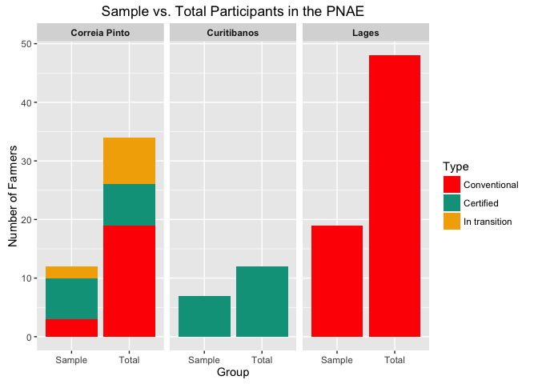

# Sample groups
Jill Guerra  
March 15, 2016  

```r
rawdf_aei<- read.csv("~/AEI_Index/Sample_group_data_R_03.15.16.csv", quote = '"', sep = ",", na.strings = c(".",""), strip.white = TRUE) # load full dataset
```


```r
library(ggplot2)
```

```
## Warning: package 'ggplot2' was built under R version 3.2.3
```

```r
#install.packages("wesanderson")
library(wesanderson) # form here https://github.com/karthik/wesanderson
```


Sample vs. Population chart! 

```r
### This works!! 

b <- ggplot(rawdf_aei, aes(x = pop, y = number, fill = Type)) + 
    geom_bar(stat = 'identity', position = 'stack') + 
    facet_grid(~ municipality) + 
    ggtitle("Sample vs. Total Participants in the PNAE") +
    labs(x="Group",y="Number of Farmers") + 
    scale_fill_manual(values = wes_palette("Darjeeling"), labels = c("Conventional", "Certified", "In transition"))  +
  theme(strip.text.x = element_text(face = "bold"))
# scale_fill_manual - is to change the colours and legend labels for bar charts 
# facet_grid separates by muncipality 

b
```

 


