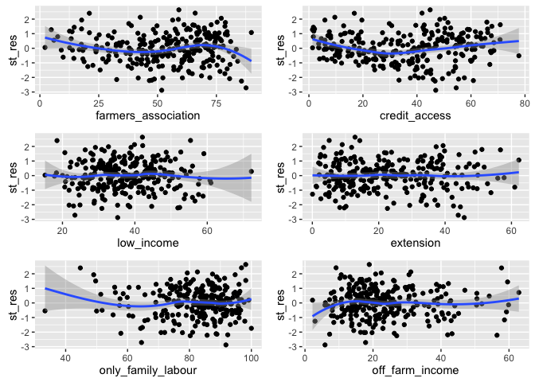

# Scale_Regression_Checks
Jill Guerra  
April 12, 2016  
UPDATED: April 12


###PART 1: LOAD DATA, CREATE SCALE
***
This section loads the packages, imports data and cleans the data of small farms and observations with NA values 
####PACKAGES

```r
library(ggplot2)
```

```
## Warning: package 'ggplot2' was built under R version 3.2.3
```

```r
suppressPackageStartupMessages(library(dplyr))
suppressPackageStartupMessages(library(gridExtra)) # for grid.arrange 
suppressPackageStartupMessages(library("moments")) # for skew & kurtosis
suppressPackageStartupMessages(library(knitr)) # for nice tables 
suppressPackageStartupMessages(library(ggbiplot)) # for PCA analysis 
suppressPackageStartupMessages(library(devtools)) # for PCA analysis as well, I believe 
suppressPackageStartupMessages(library(psych)) # needed for chronbach's alpha
suppressPackageStartupMessages(library(stats)) 
suppressPackageStartupMessages(library(stargazer)) 
```

#### DATA SET UP  - This should be in every file that I am working on)

```r
rawdf_aei<- read.csv("~/AEI_Index/Census_data_formatted_for_R_04.12.16.csv", quote = '"', sep = ",", na.strings = c(".",""), strip.white = TRUE) # load full dataset
# note that this dataset was updated in a feb 22 version to only have variables that I will be working with 
```


```r
small <- c("4202453", "4202008", "4208450", "4202057", "4201950", "4206306") # these are the codes for the municipalities that have fewer than 50 farms. Names in Result_tracking Rmd. 

'%!in%' <- function(x,y)!('%in%'(x,y)) # sweet function for negating an %in% function 

# drop the municipalities that are held in the 'small' value. 
df_aei <- rawdf_aei %>% 
  filter(code %!in% small) %>% 
  droplevels()  # need to drop levels or else the new data.frame will continue to store the other factors even though they aren't being used. See Homework 5 from stats class for more about this. 

str(df_aei) # check the factor levels. It should match the #obs shown in the global environment section. If it does not then the droplevels() didn't work. 
```


```r
na_obs <- df_aei[rowSums(is.na(df_aei)) > 0,] # pulls out new data.frame with just the NA values

na_obs_names <- na_obs[,1]

df_aei <- df_aei %>% 
  filter(code %!in% na_obs_names) %>% 
  droplevels()

nlevels(df_aei$municipality) # should be 273! 
```

```
## [1] 273
```

###PART 2: SCALE CREATION 
***
This section will define the Agscores scale and bind it to the original dataframe, but stored in a new dataframe ('df_aei_score')

####SCALE  

```r
#columns from current dataset:

# current column numbers for orgcomp (3), manure (4), cover_crop (5), crop_rotationation (6), apm(7), production diversity (8) direct_planting(9)
ae_scale_old <- df_aei[,c(4:9)] # this one looks the best. It excludes organic compost because it as negatively related in the alpha of the scale in which it was included 
alpha(ae_scale_old)
```

```
## 
## Reliability analysis   
## Call: alpha(x = ae_scale_old)
## 
##   raw_alpha std.alpha G6(smc) average_r S/N   ase mean sd
##       0.73      0.74    0.76      0.32 2.8 0.039   27 14
## 
##  lower alpha upper     95% confidence boundaries
## 0.65 0.73 0.8 
## 
##  Reliability if an item is dropped:
##                      raw_alpha std.alpha G6(smc) average_r S/N alpha se
## manure                    0.74      0.74    0.76      0.37 2.9    0.041
## cover_crop                0.76      0.79    0.79      0.43 3.7    0.041
## crop_rotation             0.60      0.62    0.63      0.25 1.6    0.053
## apm                       0.69      0.71    0.74      0.32 2.4    0.046
## production_diversity      0.67      0.68    0.70      0.30 2.1    0.048
## direct_planting           0.63      0.65    0.65      0.27 1.8    0.051
## 
##  Item statistics 
##                        n raw.r std.r r.cor r.drop mean sd
## manure               273  0.59  0.54  0.38   0.32   44 26
## cover_crop           273  0.34  0.39  0.18   0.15   14 16
## crop_rotation        273  0.86  0.85  0.88   0.78   23 18
## apm                  273  0.62  0.65  0.52   0.46   18 17
## production_diversity 273  0.70  0.72  0.68   0.59   30 15
## direct_planting      273  0.83  0.79  0.81   0.64   34 29
```

```r
# chronbach's is 0.73

# new scae that looks pretty good. 
ae_scale <- df_aei[,c(5:9)] 
alpha(ae_scale) #= 0.74
```

```
## 
## Reliability analysis   
## Call: alpha(x = ae_scale)
## 
##   raw_alpha std.alpha G6(smc) average_r S/N   ase mean sd
##       0.74      0.74    0.76      0.37 2.9 0.041   24 14
## 
##  lower alpha upper     95% confidence boundaries
## 0.66 0.74 0.82 
## 
##  Reliability if an item is dropped:
##                      raw_alpha std.alpha G6(smc) average_r S/N alpha se
## cover_crop                0.80      0.82    0.81      0.54 4.6    0.043
## crop_rotation             0.60      0.61    0.61      0.28 1.6    0.058
## apm                       0.72      0.72    0.75      0.39 2.6    0.048
## production_diversity      0.67      0.67    0.69      0.33 2.0    0.052
## direct_planting           0.63      0.62    0.62      0.29 1.7    0.057
## 
##  Item statistics 
##                        n raw.r std.r r.cor r.drop mean sd
## cover_crop           273  0.36  0.42  0.17   0.14   14 16
## crop_rotation        273  0.87  0.85  0.87   0.77   23 18
## apm                  273  0.63  0.66  0.50   0.44   18 17
## production_diversity 273  0.76  0.76  0.71   0.64   30 15
## direct_planting      273  0.88  0.83  0.84   0.70   34 29
```

```r
cor(df_aei$direct_planting, df_aei$credit_access)
```

```
## [1] 0.795827
```


```r
#Creating scores
agscores <- ((df_aei$apm +df_aei$crop_rotation + df_aei$direct_planting + df_aei$manure + df_aei$cover_crop + df_aei$production_diversity)/6) # testing one score set 

str(agscores)

# bind the scores onto the original dataframe but store as a new dataframe
df_aei_scores <- cbind(df_aei, agscores) 
df_aei_scores
write.csv(df_aei_scores, file = "df_aei_scores.csv")
```

###PART 3: INITIAL REGRESSIONS
***
#### REGRESSIONS - without any leverage/outliers removed 

Regression with all independent variables 

```r
lm_sep1 <- lm(agscores ~ low_income + credit_access + extension+ farmers_association + only_family_labour + off_farm_income, df_aei_scores)
summary(lm_sep1)
```

```
## 
## Call:
## lm(formula = agscores ~ low_income + credit_access + extension + 
##     farmers_association + only_family_labour + off_farm_income, 
##     data = df_aei_scores)
## 
## Residuals:
##      Min       1Q   Median       3Q      Max 
## -27.5854  -6.8843   0.2962   6.2988  25.3625 
## 
## Coefficients:
##                      Estimate Std. Error t value Pr(>|t|)    
## (Intercept)         -20.80806    6.25657  -3.326 0.001006 ** 
## low_income            0.11793    0.07288   1.618 0.106832    
## credit_access         0.47731    0.04890   9.761  < 2e-16 ***
## extension             0.10743    0.05214   2.061 0.040316 *  
## farmers_association   0.04789    0.04148   1.155 0.249317    
## only_family_labour    0.21090    0.05582   3.778 0.000195 ***
## off_farm_income       0.17075    0.06183   2.762 0.006154 ** 
## ---
## Signif. codes:  0 '***' 0.001 '**' 0.01 '*' 0.05 '.' 0.1 ' ' 1
## 
## Residual standard error: 9.698 on 266 degrees of freedom
## Multiple R-squared:  0.4995,	Adjusted R-squared:  0.4882 
## F-statistic: 44.24 on 6 and 266 DF,  p-value: < 2.2e-16
```


```r
lm_sep2 <- lm(agscores ~ low_income + credit_access + extension+ farmers_association, df_aei_scores)
summary(lm_sep2)
```

```
## 
## Call:
## lm(formula = agscores ~ low_income + credit_access + extension + 
##     farmers_association, data = df_aei_scores)
## 
## Residuals:
##      Min       1Q   Median       3Q      Max 
## -27.5673  -6.7611   0.6236   7.0751  27.9267 
## 
## Coefficients:
##                     Estimate Std. Error t value Pr(>|t|)    
## (Intercept)          2.07657    3.54527   0.586   0.5586    
## low_income           0.17184    0.07416   2.317   0.0213 *  
## credit_access        0.41591    0.04744   8.767   <2e-16 ***
## extension            0.06734    0.05270   1.278   0.2024    
## farmers_association  0.03921    0.04273   0.918   0.3597    
## ---
## Signif. codes:  0 '***' 0.001 '**' 0.01 '*' 0.05 '.' 0.1 ' ' 1
## 
## Residual standard error: 10.01 on 268 degrees of freedom
## Multiple R-squared:  0.4627,	Adjusted R-squared:  0.4546 
## F-statistic: 57.69 on 4 and 268 DF,  p-value: < 2.2e-16
```


```r
lm_2by2_1 <- lm(agscores ~ low_income + credit_access, df_aei_scores)
summary(lm_2by2_1)
```

```
## 
## Call:
## lm(formula = agscores ~ low_income + credit_access, data = df_aei_scores)
## 
## Residuals:
##      Min       1Q   Median       3Q      Max 
## -26.4999  -6.5544   0.3533   6.9520  27.2587 
## 
## Coefficients:
##               Estimate Std. Error t value Pr(>|t|)    
## (Intercept)    5.88505    2.60161   2.262   0.0245 *  
## low_income     0.11877    0.06491   1.830   0.0684 .  
## credit_access  0.46658    0.03222  14.479   <2e-16 ***
## ---
## Signif. codes:  0 '***' 0.001 '**' 0.01 '*' 0.05 '.' 0.1 ' ' 1
## 
## Residual standard error: 10.02 on 270 degrees of freedom
## Multiple R-squared:  0.4576,	Adjusted R-squared:  0.4536 
## F-statistic: 113.9 on 2 and 270 DF,  p-value: < 2.2e-16
```

```r
lm_2by2_2 <- lm(agscores ~ extension+ farmers_association, df_aei_scores)
summary(lm_2by2_2)
```

```
## 
## Call:
## lm(formula = agscores ~ extension + farmers_association, data = df_aei_scores)
## 
## Residuals:
##     Min      1Q  Median      3Q     Max 
## -32.628  -7.786   0.549   8.946  31.495 
## 
## Coefficients:
##                     Estimate Std. Error t value Pr(>|t|)    
## (Intercept)          8.12696    2.17050   3.744 0.000221 ***
## extension            0.13044    0.05329   2.448 0.015007 *  
## farmers_association  0.30108    0.03898   7.723 2.22e-13 ***
## ---
## Signif. codes:  0 '***' 0.001 '**' 0.01 '*' 0.05 '.' 0.1 ' ' 1
## 
## Residual standard error: 11.85 on 270 degrees of freedom
## Multiple R-squared:  0.2419,	Adjusted R-squared:  0.2363 
## F-statistic: 43.09 on 2 and 270 DF,  p-value: < 2.2e-16
```

ANOVA 

```r
anova(lm_sep1)
```

```
## Analysis of Variance Table
## 
## Response: agscores
##                      Df  Sum Sq Mean Sq  F value    Pr(>F)    
## low_income            1  1823.8  1823.8  19.3896 1.546e-05 ***
## credit_access         1 21052.1 21052.1 223.8141 < 2.2e-16 ***
## extension             1   166.7   166.7   1.7724 0.1842281    
## farmers_association   1    84.4    84.4   0.8971 0.3444332    
## only_family_labour    1  1123.0  1123.0  11.9389 0.0006397 ***
## off_farm_income       1   717.3   717.3   7.6259 0.0061543 ** 
## Residuals           266 25020.1    94.1                       
## ---
## Signif. codes:  0 '***' 0.001 '**' 0.01 '*' 0.05 '.' 0.1 ' ' 1
```

PLOT REGRESSION

```r
plot(lm_sep1)
```

    

#### REGRESSIONS WITH INDIVIDUAL DEPENDENT VARIABLES

```r
#COVER CROP 
lm_cover_crop <- lm(cover_crop ~ low_income + credit_access + extension+ farmers_association + only_family_labour + off_farm_income, df_aei)
summary(lm_cover_crop)
```

```
## 
## Call:
## lm(formula = cover_crop ~ low_income + credit_access + extension + 
##     farmers_association + only_family_labour + off_farm_income, 
##     data = df_aei)
## 
## Residuals:
##     Min      1Q  Median      3Q     Max 
## -23.937 -10.253  -4.290   7.724  53.975 
## 
## Coefficients:
##                     Estimate Std. Error t value Pr(>|t|)   
## (Intercept)         15.03282    9.97574   1.507  0.13301   
## low_income          -0.19252    0.11621  -1.657  0.09876 . 
## credit_access        0.15879    0.07797   2.037  0.04267 * 
## extension            0.21794    0.08313   2.622  0.00925 **
## farmers_association -0.11058    0.06613  -1.672  0.09568 . 
## only_family_labour   0.02427    0.08901   0.273  0.78534   
## off_farm_income     -0.02711    0.09859  -0.275  0.78353   
## ---
## Signif. codes:  0 '***' 0.001 '**' 0.01 '*' 0.05 '.' 0.1 ' ' 1
## 
## Residual standard error: 15.46 on 266 degrees of freedom
## Multiple R-squared:  0.09443,	Adjusted R-squared:  0.074 
## F-statistic: 4.623 on 6 and 266 DF,  p-value: 0.0001735
```

```r
#CROP ROTATION 
lm_crop_rotation <- lm(crop_rotation ~ low_income + credit_access + extension+ farmers_association + only_family_labour + off_farm_income, df_aei)
summary(lm_crop_rotation)
```

```
## 
## Call:
## lm(formula = crop_rotation ~ low_income + credit_access + extension + 
##     farmers_association + only_family_labour + off_farm_income, 
##     data = df_aei)
## 
## Residuals:
##     Min      1Q  Median      3Q     Max 
## -35.828  -7.223  -0.036   7.819  33.997 
## 
## Coefficients:
##                      Estimate Std. Error t value Pr(>|t|)    
## (Intercept)         -35.65306    7.85127  -4.541 8.49e-06 ***
## low_income            0.24038    0.09146   2.628  0.00908 ** 
## credit_access         0.64756    0.06136  10.553  < 2e-16 ***
## extension             0.04497    0.06542   0.687  0.49242    
## farmers_association   0.09575    0.05205   1.840  0.06693 .  
## only_family_labour    0.20048    0.07005   2.862  0.00455 ** 
## off_farm_income       0.17109    0.07759   2.205  0.02831 *  
## ---
## Signif. codes:  0 '***' 0.001 '**' 0.01 '*' 0.05 '.' 0.1 ' ' 1
## 
## Residual standard error: 12.17 on 266 degrees of freedom
## Multiple R-squared:  0.5531,	Adjusted R-squared:  0.5431 
## F-statistic: 54.88 on 6 and 266 DF,  p-value: < 2.2e-16
```

```r
#MANURE
lm_manure <- lm(manure ~ low_income + credit_access + extension+ farmers_association + only_family_labour + off_farm_income, df_aei)
summary(lm_manure)
```

```
## 
## Call:
## lm(formula = manure ~ low_income + credit_access + extension + 
##     farmers_association + only_family_labour + off_farm_income, 
##     data = df_aei)
## 
## Residuals:
##    Min     1Q Median     3Q    Max 
## -47.83 -18.63  -2.63  20.36  61.83 
## 
## Coefficients:
##                     Estimate Std. Error t value Pr(>|t|)   
## (Intercept)          7.70805   16.15645   0.477  0.63369   
## low_income          -0.47806    0.18821  -2.540  0.01165 * 
## credit_access        0.20863    0.12627   1.652  0.09967 . 
## extension            0.14057    0.13463   1.044  0.29737   
## farmers_association  0.06039    0.10710   0.564  0.57336   
## only_family_labour   0.39406    0.14416   2.734  0.00669 **
## off_farm_income      0.35222    0.15967   2.206  0.02824 * 
## ---
## Signif. codes:  0 '***' 0.001 '**' 0.01 '*' 0.05 '.' 0.1 ' ' 1
## 
## Residual standard error: 25.04 on 266 degrees of freedom
## Multiple R-squared:  0.06929,	Adjusted R-squared:  0.0483 
## F-statistic: 3.301 on 6 and 266 DF,  p-value: 0.00377
```

```r
#APM
lm_apm <- lm(apm ~ low_income + credit_access + extension+ farmers_association + only_family_labour + off_farm_income, df_aei)

#production_diversity
lm_production_diversity <- lm(production_diversity ~ low_income + credit_access + extension+ farmers_association + only_family_labour + off_farm_income, df_aei)
summary(lm_production_diversity)
```

```
## 
## Call:
## lm(formula = production_diversity ~ low_income + credit_access + 
##     extension + farmers_association + only_family_labour + off_farm_income, 
##     data = df_aei)
## 
## Residuals:
##     Min      1Q  Median      3Q     Max 
## -21.792  -6.197  -1.204   6.319  43.269 
## 
## Coefficients:
##                      Estimate Std. Error t value Pr(>|t|)    
## (Intercept)         -45.75312    6.36961  -7.183 6.85e-12 ***
## low_income            0.63727    0.07420   8.589 7.55e-16 ***
## credit_access         0.39190    0.04978   7.872 8.85e-14 ***
## extension             0.01099    0.05308   0.207  0.83607    
## farmers_association   0.10968    0.04223   2.597  0.00992 ** 
## only_family_labour    0.34984    0.05683   6.156 2.74e-09 ***
## off_farm_income       0.11747    0.06295   1.866  0.06311 .  
## ---
## Signif. codes:  0 '***' 0.001 '**' 0.01 '*' 0.05 '.' 0.1 ' ' 1
## 
## Residual standard error: 9.874 on 266 degrees of freedom
## Multiple R-squared:  0.5835,	Adjusted R-squared:  0.5741 
## F-statistic:  62.1 on 6 and 266 DF,  p-value: < 2.2e-16
```

```r
#direct_planting
lm_direct_planting <- lm(direct_planting ~ low_income + credit_access + extension+ farmers_association + only_family_labour + off_farm_income, df_aei)
summary(lm_direct_planting)
```

```
## 
## Call:
## lm(formula = direct_planting ~ low_income + credit_access + extension + 
##     farmers_association + only_family_labour + off_farm_income, 
##     data = df_aei)
## 
## Residuals:
##     Min      1Q  Median      3Q     Max 
## -45.956 -11.521   0.382  10.478  58.336 
## 
## Coefficients:
##                      Estimate Std. Error t value Pr(>|t|)    
## (Intercept)         -52.19232   11.05864  -4.720 3.82e-06 ***
## low_income            0.31562    0.12882   2.450   0.0149 *  
## credit_access         1.26480    0.08643  14.634  < 2e-16 ***
## extension             0.00379    0.09215   0.041   0.9672    
## farmers_association   0.01816    0.07331   0.248   0.8046    
## only_family_labour    0.28201    0.09867   2.858   0.0046 ** 
## off_farm_income       0.18766    0.10929   1.717   0.0871 .  
## ---
## Signif. codes:  0 '***' 0.001 '**' 0.01 '*' 0.05 '.' 0.1 ' ' 1
## 
## Residual standard error: 17.14 on 266 degrees of freedom
## Multiple R-squared:  0.6636,	Adjusted R-squared:  0.656 
## F-statistic: 87.44 on 6 and 266 DF,  p-value: < 2.2e-16
```

```r
#no_agrichemicals
lm_no_agrichemicals <- lm(no_agrichemicals ~ low_income + credit_access + extension+ farmers_association + only_family_labour + off_farm_income, df_aei)
summary(lm_no_agrichemicals)
```

```
## 
## Call:
## lm(formula = no_agrichemicals ~ low_income + credit_access + 
##     extension + farmers_association + only_family_labour + off_farm_income, 
##     data = df_aei)
## 
## Residuals:
##     Min      1Q  Median      3Q     Max 
## -28.502 -10.322  -1.438   9.698  44.340 
## 
## Coefficients:
##                     Estimate Std. Error t value Pr(>|t|)    
## (Intercept)         28.84370    9.40089   3.068  0.00238 ** 
## low_income           0.30144    0.10951   2.753  0.00632 ** 
## credit_access       -0.62495    0.07347  -8.506 1.32e-15 ***
## extension           -0.17607    0.07834  -2.248  0.02543 *  
## farmers_association -0.12794    0.06232  -2.053  0.04105 *  
## only_family_labour   0.26363    0.08388   3.143  0.00186 ** 
## off_farm_income      0.39732    0.09290   4.277 2.65e-05 ***
## ---
## Signif. codes:  0 '***' 0.001 '**' 0.01 '*' 0.05 '.' 0.1 ' ' 1
## 
## Residual standard error: 14.57 on 266 degrees of freedom
## Multiple R-squared:  0.629,	Adjusted R-squared:  0.6206 
## F-statistic: 75.16 on 6 and 266 DF,  p-value: < 2.2e-16
```

####INDIVIDUAL INDEPENDENT VARIABLES ON AG SCORES

```r
pl_cred <- ggplot(df_aei_scores, aes(x=agscores, y = credit_access)) +
  geom_point() +
  geom_smooth(method=lm)

pl_assoc <- ggplot(df_aei_scores, aes(x=agscores, y = farmers_association)) +
  geom_point() +
  geom_smooth(method=lm)

pl_extension<- ggplot(df_aei_scores, aes(x=agscores, y = extension)) +
  geom_point() +
  geom_smooth(method=lm)

pl_low_income <- ggplot(df_aei_scores, aes(x=agscores, y = low_income)) +
  geom_point() +
  geom_smooth(method=lm)

pl_offfarm <- ggplot(df_aei_scores, aes(x=agscores, y = off_farm_income)) +
  geom_point() +
  geom_smooth(method=lm)

pl_only_family_labour <- ggplot(df_aei_scores, aes(x=agscores, y = only_family_labour)) +
  geom_point() +
  geom_smooth(method=lm)

grid.arrange(pl_cred, pl_assoc, pl_extension, pl_offfarm, pl_low_income, pl_only_family_labour, ncol=3)
```

 

### PART 4: REGRESSION CHECKS 
***

####RESIDUALS

```r
 st_res <- rstandard(lm_sep1) #pulls out the standard residuals from the regression

#Residuals for all independent variables 
stres_a <- ggplot(df_aei_scores, aes(farmers_association, st_res)) +
  geom_point() +
  stat_smooth()

stres_c <- ggplot(df_aei_scores, aes(credit_access, st_res)) +
  geom_point() +
  stat_smooth()

stres_i <- ggplot(df_aei_scores, aes(low_income, st_res)) +
  geom_point() +
  stat_smooth()

stres_t <- ggplot(df_aei_scores, aes(extension, st_res)) +
  geom_point() +
  stat_smooth()

stres_fl <- ggplot(df_aei_scores, aes(only_family_labour, st_res)) +
  geom_point() +
  stat_smooth()

stres_of <- ggplot(df_aei_scores, aes(off_farm_income, st_res)) +
  geom_point() +
  stat_smooth()

grid.arrange(stres_a, stres_c, stres_i, stres_t, stres_fl, stres_of, ncol=2)
```

 

#### RESIDUALS & LEVERAGE

```r
summary(lm_sep1)
```

```
## 
## Call:
## lm(formula = agscores ~ low_income + credit_access + extension + 
##     farmers_association + only_family_labour + off_farm_income, 
##     data = df_aei_scores)
## 
## Residuals:
##      Min       1Q   Median       3Q      Max 
## -27.5854  -6.8843   0.2962   6.2988  25.3625 
## 
## Coefficients:
##                      Estimate Std. Error t value Pr(>|t|)    
## (Intercept)         -20.80806    6.25657  -3.326 0.001006 ** 
## low_income            0.11793    0.07288   1.618 0.106832    
## credit_access         0.47731    0.04890   9.761  < 2e-16 ***
## extension             0.10743    0.05214   2.061 0.040316 *  
## farmers_association   0.04789    0.04148   1.155 0.249317    
## only_family_labour    0.21090    0.05582   3.778 0.000195 ***
## off_farm_income       0.17075    0.06183   2.762 0.006154 ** 
## ---
## Signif. codes:  0 '***' 0.001 '**' 0.01 '*' 0.05 '.' 0.1 ' ' 1
## 
## Residual standard error: 9.698 on 266 degrees of freedom
## Multiple R-squared:  0.4995,	Adjusted R-squared:  0.4882 
## F-statistic: 44.24 on 6 and 266 DF,  p-value: < 2.2e-16
```

```r
opar <- par(mfrow = c(2,2), oma = c(0, 0, 1.1, 0)) # not quite sure what this does but got it from ats.ucla website shown below 
plot(lm_sep1, las = 1) # highlights the observations that may be problematic 
```

 

```r
par(opar)
```
###LIST OF PROBLEM CASES 

```r
# Cases identified April 7th with data set excluding small farms and NAs and an ag scale of cover crop, crop rot, apm, manure, direct_planting and production_diversity
# enter observation numbers and display the 
df_aei_scores[c(10,29,58,105,273), 1:2]
```

```
##        code        municipality
## 10  4200754     Alto Bela Vista
## 29  4202131 Bela Vista do Toldo
## 58  4204178         Cerro Negro
## 105 4207403              Imbuia
## 273 4219853              Zortea
```
###Cook's D and Studentized residuals

```r
cd <- cooks.distance(lm_sep1) # run cook's D looking for leverage and residual
sres <- rstandard(lm_sep1) #  calculate standardized residuals
df_diag_sep <- cbind(df_aei_scores, cd, sres) # add cooks D and student residuals to the dataframe

#COOK'S D
cooks_d <- df_diag_sep[cd > 4/(268), ] #pull out on the cook's D's that are beyond the hypothetical cutoff. Degrees of freedom for lm_sep is 268 (from the summary output)

#RESIDUALS
rabs <- abs(sres) # absolute value of the residuals
df_diag_sep <- cbind(df_diag_sep, rabs) # bind these residuals with the previous df
df_diag_sep <- df_diag_sep[order(-rabs), ] # reorder according to absolute value residuals
big_residuals <- df_diag_sep[1:10,] # this shows the largest residuals 
```

####RESULTS 

```r
knitr::kable(cooks_d[,c(1, 2, 17)]) 
```

          code  municipality            agscores
----  --------  --------------------  ----------
1      4200051  Abdon Batista          24.740000
10     4200754  Alto Bela Vista        59.081667
13     4201000  Anita Garibaldi        10.148333
29     4202131  Bela Vista do Toldo     5.931667
58     4204178  Cerro Negro            17.623333
65     4204459  Coronel Martins        52.071667
105    4207403  Imbuia                  7.611667
120    4208500  Ituporanga             14.578333
145    4210308  Major Vieira           11.631667
151    4210803  Meleiro                11.600000
155    4211058  Monte Carlo            20.343333
160    4211405  Nova Erechim           54.328333
196    4214300  Rancho Queimado        25.176667
217    4215695  Santiago do Sul        23.490000
246    4217956  Tigrinhos              54.358333
258    4218806  Turvo                  10.795000
273    4219853  Zortea                 33.248333

```r
knitr::kable(big_residuals[,c(1, 2, 19)])
```

          code  municipality                sres
----  --------  --------------------  ----------
29     4202131  Bela Vista do Toldo    -2.879439
105    4207403  Imbuia                 -2.715039
10     4200754  Alto Bela Vista         2.636085
246    4217956  Tigrinhos               2.410621
273    4219853  Zortea                  2.400642
151    4210803  Meleiro                -2.251569
1      4200051  Abdon Batista          -2.215533
13     4201000  Anita Garibaldi        -2.186427
145    4210308  Major Vieira           -2.144646
221    4215901  Sao Bonifacio           2.127901

####LIST OF PROBLEM CASES 
Municipalities that showed up on more than 1 of the above tables or from the earlier plots 

```r
prob_cases <- df_aei_scores[c(10, 21,29,58,77,145,246,258,273), 1:2]
knitr::kable(prob_cases) # nice table of problem cases 
```

          code  municipality        
----  --------  --------------------
10     4200754  Alto Bela Vista     
21     4201604  Arroio Trinta       
29     4202131  Bela Vista do Toldo 
58     4204178  Cerro Negro         
77     4205191  Ermo                
145    4210308  Major Vieira        
246    4217956  Tigrinhos           
258    4218806  Turvo               
273    4219853  Zortea              

###PART 5: RESPECIFICATION 
***
Rerun the regressions as performed earlier but without the leverage and outliers. Remember that the ag scores are already defined from earlier, so do not need to add again. 

####REMOVE PROBLEM CASES

```r
prob_cases_codes <- prob_cases[,1] # pull out just the code names of the cases identified in the previous chunk 

rerun_df_aei_scores <- df_aei_scores %>% 
  filter(code %!in% prob_cases_codes) %>% # remove all cases identified in previous chunk
  droplevels() # drop factor levels 

str(rerun_df_aei_scores)
```

```
## 'data.frame':	264 obs. of  17 variables:
##  $ code                : int  4200051 4200101 4200200 4200309 4200408 4200507 4200556 4200606 4200705 4200804 ...
##  $ municipality        : Factor w/ 264 levels "Abdon Batista",..: 1 2 3 4 5 6 7 8 9 10 ...
##  $ orgcomp             : num  7.26 5.45 3.74 3.96 25.59 ...
##  $ manure              : num  18.06 9.65 44.3 10.84 54.95 ...
##  $ cover_crop          : num  8.82 3.43 33.49 60.75 3.59 ...
##  $ crop_rotation       : num  18.3 24.5 24.8 11.6 33 ...
##  $ apm                 : num  1.26 0.43 55.99 3.97 40.74 ...
##  $ production_diversity: num  42.2 47.2 37.6 17.5 21.9 ...
##  $ direct_planting     : num  59.8 75.4 44.9 33.4 58.9 ...
##  $ only_family_labour  : num  85.7 95.9 85.9 81 78.1 ...
##  $ low_income          : num  51.9 60.8 38.5 24.8 26.4 ...
##  $ farmers_association : num  46.5 63.4 38.9 49.6 56.1 ...
##  $ extension           : num  9.62 17.2 22.26 46.74 21.34 ...
##  $ credit_access       : num  60.9 34 30.6 40.1 47.8 ...
##  $ off_farm_income     : num  56.5 12.7 26 15.1 23.6 ...
##  $ no_agrichemicals    : num  21.1 25.3 17.3 10.2 49.6 ...
##  $ agscores            : num  24.7 26.8 40.2 23 35.5 ...
```

#####REGRESSION

```r
lm_sep_rr <- lm(agscores ~ low_income + credit_access + extension+ farmers_association, rerun_df_aei_scores)
summary(lm_sep_rr)
```

```
## 
## Call:
## lm(formula = agscores ~ low_income + credit_access + extension + 
##     farmers_association, data = rerun_df_aei_scores)
## 
## Residuals:
##      Min       1Q   Median       3Q      Max 
## -28.3098  -6.6587   0.4957   6.6911  20.0372 
## 
## Coefficients:
##                     Estimate Std. Error t value Pr(>|t|)    
## (Intercept)         -0.38607    3.41794  -0.113  0.91015    
## low_income           0.20970    0.07125   2.943  0.00354 ** 
## credit_access        0.39818    0.04452   8.943  < 2e-16 ***
## extension            0.13220    0.05004   2.642  0.00874 ** 
## farmers_association  0.04415    0.04051   1.090  0.27682    
## ---
## Signif. codes:  0 '***' 0.001 '**' 0.01 '*' 0.05 '.' 0.1 ' ' 1
## 
## Residual standard error: 9.264 on 259 degrees of freedom
## Multiple R-squared:  0.5174,	Adjusted R-squared:  0.5099 
## F-statistic: 69.41 on 4 and 259 DF,  p-value: < 2.2e-16
```


```r
lm_2by2_1_rr <- lm(agscores ~ low_income + credit_access, rerun_df_aei_scores)
summary(lm_2by2_1_rr)
```

```
## 
## Call:
## lm(formula = agscores ~ low_income + credit_access, data = rerun_df_aei_scores)
## 
## Residuals:
##      Min       1Q   Median       3Q      Max 
## -26.8292  -5.6959   0.3879   6.7093  21.9546 
## 
## Coefficients:
##               Estimate Std. Error t value Pr(>|t|)    
## (Intercept)    6.07015    2.49556   2.432   0.0157 *  
## low_income     0.10853    0.06252   1.736   0.0838 .  
## credit_access  0.47363    0.03030  15.629   <2e-16 ***
## ---
## Signif. codes:  0 '***' 0.001 '**' 0.01 '*' 0.05 '.' 0.1 ' ' 1
## 
## Residual standard error: 9.373 on 261 degrees of freedom
## Multiple R-squared:  0.5021,	Adjusted R-squared:  0.4983 
## F-statistic: 131.6 on 2 and 261 DF,  p-value: < 2.2e-16
```

```r
lm_2by2_2_rr <- lm(agscores ~ extension+ farmers_association, rerun_df_aei_scores)
summary(lm_2by2_2_rr)
```

```
## 
## Call:
## lm(formula = agscores ~ extension + farmers_association, data = rerun_df_aei_scores)
## 
## Residuals:
##     Min      1Q  Median      3Q     Max 
## -33.642  -7.431   0.467   8.214  25.168 
## 
## Coefficients:
##                     Estimate Std. Error t value Pr(>|t|)    
## (Intercept)          7.11780    2.08438   3.415  0.00074 ***
## extension            0.17787    0.05179   3.435  0.00069 ***
## farmers_association  0.30039    0.03763   7.983 4.55e-14 ***
## ---
## Signif. codes:  0 '***' 0.001 '**' 0.01 '*' 0.05 '.' 0.1 ' ' 1
## 
## Residual standard error: 11.24 on 261 degrees of freedom
## Multiple R-squared:  0.2845,	Adjusted R-squared:  0.2791 
## F-statistic:  51.9 on 2 and 261 DF,  p-value: < 2.2e-16
```

ANOVA 

```r
anova(lm_sep_rr)
```

```
## Analysis of Variance Table
## 
## Response: agscores
##                      Df  Sum Sq Mean Sq  F value    Pr(>F)    
## low_income            1  1659.9  1659.9  19.3437 1.596e-05 ***
## credit_access         1 21460.0 21460.0 250.0788 < 2.2e-16 ***
## extension             1   602.1   602.1   7.0160  0.008575 ** 
## farmers_association   1   101.9   101.9   1.1876  0.276821    
## Residuals           259 22225.6    85.8                       
## ---
## Signif. codes:  0 '***' 0.001 '**' 0.01 '*' 0.05 '.' 0.1 ' ' 1
```

PLOT REGRESSION

```r
plot(lm_sep_rr)
```

    

#### REGRESSIONS WITH INDIVIDUAL DEPENDENT VARIABLES

```r
#COVER CROP 
lm_cover_crop_rr <- lm(cover_crop ~ low_income + credit_access + extension+ farmers_association, rerun_df_aei_scores)
summary(lm_cover_crop_rr)
```

```
## 
## Call:
## lm(formula = cover_crop ~ low_income + credit_access + extension + 
##     farmers_association, data = rerun_df_aei_scores)
## 
## Residuals:
##     Min      1Q  Median      3Q     Max 
## -25.361 -10.201  -3.786   8.051  50.486 
## 
## Coefficients:
##                     Estimate Std. Error t value Pr(>|t|)    
## (Intercept)         18.60788    5.50476   3.380 0.000836 ***
## low_income          -0.25055    0.11475  -2.183 0.029908 *  
## credit_access        0.17015    0.07171   2.373 0.018377 *  
## extension            0.23844    0.08059   2.959 0.003373 ** 
## farmers_association -0.12944    0.06525  -1.984 0.048329 *  
## ---
## Signif. codes:  0 '***' 0.001 '**' 0.01 '*' 0.05 '.' 0.1 ' ' 1
## 
## Residual standard error: 14.92 on 259 degrees of freedom
## Multiple R-squared:  0.1175,	Adjusted R-squared:  0.1039 
## F-statistic: 8.623 on 4 and 259 DF,  p-value: 1.51e-06
```

```r
plot(lm_cover_crop_rr)
```

    

```r
#CROP ROTATION 
lm_crop_rotation_rr <- lm(crop_rotation ~ low_income + credit_access + extension+ farmers_association, rerun_df_aei_scores)
summary(lm_crop_rotation_rr)
```

```
## 
## Call:
## lm(formula = crop_rotation ~ low_income + credit_access + extension + 
##     farmers_association, data = rerun_df_aei_scores)
## 
## Residuals:
##     Min      1Q  Median      3Q     Max 
## -30.295  -6.939   0.264   7.855  32.956 
## 
## Coefficients:
##                      Estimate Std. Error t value Pr(>|t|)    
## (Intercept)         -15.47119    4.46213  -3.467 0.000616 ***
## low_income            0.31676    0.09302   3.405 0.000766 ***
## credit_access         0.57701    0.05812   9.927  < 2e-16 ***
## extension             0.06101    0.06532   0.934 0.351149    
## farmers_association   0.09130    0.05289   1.726 0.085495 .  
## ---
## Signif. codes:  0 '***' 0.001 '**' 0.01 '*' 0.05 '.' 0.1 ' ' 1
## 
## Residual standard error: 12.09 on 259 degrees of freedom
## Multiple R-squared:  0.557,	Adjusted R-squared:  0.5502 
## F-statistic: 81.43 on 4 and 259 DF,  p-value: < 2.2e-16
```

```r
plot(lm_crop_rotation_rr)
```

    

```r
#MANURE
lm_manure_rr <- lm(manure ~ low_income + credit_access + extension+ farmers_association, rerun_df_aei_scores)
summary(lm_manure_rr)
```

```
## 
## Call:
## lm(formula = manure ~ low_income + credit_access + extension + 
##     farmers_association, data = rerun_df_aei_scores)
## 
## Residuals:
##     Min      1Q  Median      3Q     Max 
## -49.417 -17.368  -2.736  20.585  59.791 
## 
## Coefficients:
##                     Estimate Std. Error t value Pr(>|t|)    
## (Intercept)          47.8835     9.1803   5.216 3.75e-07 ***
## low_income           -0.3092     0.1914  -1.616    0.107    
## credit_access         0.0583     0.1196   0.487    0.626    
## extension             0.1704     0.1344   1.268    0.206    
## farmers_association   0.0411     0.1088   0.378    0.706    
## ---
## Signif. codes:  0 '***' 0.001 '**' 0.01 '*' 0.05 '.' 0.1 ' ' 1
## 
## Residual standard error: 24.88 on 259 degrees of freedom
## Multiple R-squared:  0.03918,	Adjusted R-squared:  0.02434 
## F-statistic: 2.641 on 4 and 259 DF,  p-value: 0.03432
```

```r
plot(lm_manure_rr)
```

    

```r
#APM
lm_apm_rr <- lm(apm ~ low_income + credit_access + extension+ farmers_association, rerun_df_aei_scores)
summary(lm_apm_rr)
```

```
## 
## Call:
## lm(formula = apm ~ low_income + credit_access + extension + farmers_association, 
##     data = rerun_df_aei_scores)
## 
## Residuals:
##     Min      1Q  Median      3Q     Max 
## -26.992 -10.509  -3.680   7.944  55.741 
## 
## Coefficients:
##                     Estimate Std. Error t value Pr(>|t|)   
## (Intercept)         -8.11022    5.71066  -1.420   0.1568   
## low_income           0.26371    0.11905   2.215   0.0276 * 
## credit_access        0.11319    0.07439   1.522   0.1293   
## extension            0.26513    0.08360   3.171   0.0017 **
## farmers_association  0.10560    0.06769   1.560   0.1200   
## ---
## Signif. codes:  0 '***' 0.001 '**' 0.01 '*' 0.05 '.' 0.1 ' ' 1
## 
## Residual standard error: 15.48 on 259 degrees of freedom
## Multiple R-squared:  0.1487,	Adjusted R-squared:  0.1355 
## F-statistic: 11.31 on 4 and 259 DF,  p-value: 1.795e-08
```

```r
plot(lm_apm_rr)
```

    

```r
#production_diversity
lm_production_diversity_rr <- lm(production_diversity ~ low_income + credit_access + extension+ farmers_association, rerun_df_aei_scores)
summary(lm_production_diversity_rr)
```

```
## 
## Call:
## lm(formula = production_diversity ~ low_income + credit_access + 
##     extension + farmers_association, data = rerun_df_aei_scores)
## 
## Residuals:
##     Min      1Q  Median      3Q     Max 
## -29.359  -6.543  -1.444   6.734  29.666 
## 
## Coefficients:
##                      Estimate Std. Error t value Pr(>|t|)    
## (Intercept)         -15.57580    3.73788  -4.167 4.21e-05 ***
## low_income            0.73882    0.07792   9.482  < 2e-16 ***
## credit_access         0.31951    0.04869   6.562 2.87e-10 ***
## extension             0.01836    0.05472   0.336   0.7375    
## farmers_association   0.10738    0.04430   2.424   0.0161 *  
## ---
## Signif. codes:  0 '***' 0.001 '**' 0.01 '*' 0.05 '.' 0.1 ' ' 1
## 
## Residual standard error: 10.13 on 259 degrees of freedom
## Multiple R-squared:  0.5465,	Adjusted R-squared:  0.5395 
## F-statistic: 78.04 on 4 and 259 DF,  p-value: < 2.2e-16
```

```r
plot(lm_production_diversity_rr)
```

    

```r
#direct_planting
lm_direct_planting_rr <- lm(direct_planting ~ low_income + credit_access + extension+ farmers_association, rerun_df_aei_scores)
summary(lm_direct_planting_rr)
```

```
## 
## Call:
## lm(formula = direct_planting ~ low_income + credit_access + extension + 
##     farmers_association, data = rerun_df_aei_scores)
## 
## Residuals:
##     Min      1Q  Median      3Q     Max 
## -49.328 -10.356   0.558  10.341  52.766 
## 
## Coefficients:
##                      Estimate Std. Error t value Pr(>|t|)    
## (Intercept)         -29.65059    6.10995  -4.853  2.1e-06 ***
## low_income            0.49865    0.12737   3.915 0.000116 ***
## credit_access         1.15093    0.07959  14.461  < 2e-16 ***
## extension             0.03983    0.08944   0.445 0.656470    
## farmers_association   0.04896    0.07242   0.676 0.499626    
## ---
## Signif. codes:  0 '***' 0.001 '**' 0.01 '*' 0.05 '.' 0.1 ' ' 1
## 
## Residual standard error: 16.56 on 259 degrees of freedom
## Multiple R-squared:  0.6855,	Adjusted R-squared:  0.6807 
## F-statistic: 141.1 on 4 and 259 DF,  p-value: < 2.2e-16
```

```r
plot(lm_direct_planting_rr)
```

    


TESTING REGRESSION TABLES

```r
stargazer(lm_sep1, type = "text", title="Linear Model - FULL ", digits=1, out="Regression_Tables_Using_Score_04.12.16.txt")

stargazer(lm_cover_crop, lm_crop_rotation, lm_manure, lm_direct_planting, lm_production_diversity, lm_apm, type = "text", title="Linear Model - FULL ", digits=1, out="Regression_Tables_Individ_Indep_04.12.16.txt")

stargazer(lm_no_agrichemicals, type = "text", title="Linear Model - FULL ", digits=1, out="Regression_Tables_Agrichem_04.12.16.txt")
```


Similar results as before: credit_access still the biggest predictor. 

MAPS! 
link to blog using brazilian municipalities shapefile 
https://dioferrari.wordpress.com/2014/11/27/plotting-maps-using-r-example-with-brazilian-municipal-level-data/


