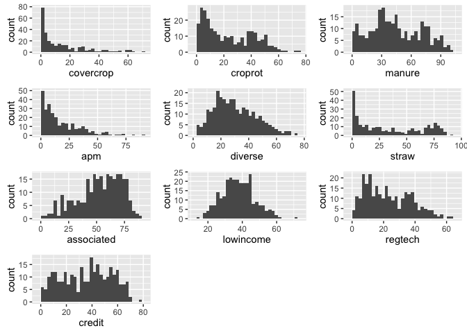

# Scale_creation_and_visualization
Jill Guerra  
February 9, 2016  
UPDATED: April 6


###PART 1: LOAD DATA, CREATE SCALE
***
This section loads the packages, imports data and cleans the data of small farms and observations with NA values 
####PACKAGES

```r
library(ggplot2)
```

```
## Warning: package 'ggplot2' was built under R version 3.2.3
```

```r
suppressPackageStartupMessages(library(dplyr))
suppressPackageStartupMessages(library(gridExtra)) # for grid.arrange 
suppressPackageStartupMessages(library("moments")) # for skew & kurtosis
suppressPackageStartupMessages(library(knitr)) # for nice tables 
suppressPackageStartupMessages(library(ggbiplot)) # for PCA analysis 
suppressPackageStartupMessages(library(devtools)) # for PCA analysis as well, I believe 
suppressPackageStartupMessages(library(psych)) # needed for chronbach's alpha
```

#### DATA SET UP  - This should be in every file that I am working on)

```r
rawdf_aei<- read.csv("~/AEI_Index/Census_data_formatted_for_R_02.22.16.csv", quote = '"', sep = ",", na.strings = c(".",""), strip.white = TRUE) # load full dataset
# note that this dataset was updated in a feb 22 version to only have variables that I will be working with 
```


```r
small <- c("4202453", "4202008", "4208450", "4202057", "4201950", "4206306") # these are the codes for the municipalities that have fewer than 50 farms. Names in Result_tracking Rmd. 

'%!in%' <- function(x,y)!('%in%'(x,y)) # sweet function for negating an %in% function 

# drop the municipalities that are held in the 'small' value. 
df_aei <- rawdf_aei %>% 
  filter(code %!in% small) %>% 
  droplevels()  # need to drop levels or else the new data.frame will continue to store the other factors even though they aren't being used. See Homework 5 from stats class for more about this. 

str(df_aei) # check the factor levels. It should match the #obs shown in the global environment section. If it does not then the droplevels() didn't work. 
```


```r
df_aei <- df_aei %>% 
  na.omit() %>% 
  droplevels() # take out observations that have an NA in any variable 

str(df_aei)
```

```
## 'data.frame':	273 obs. of  15 variables:
##  $ code        : int  4200051 4200101 4200200 4200309 4200408 4200507 4200556 4200606 4200705 4200754 ...
##  $ municipality: Factor w/ 273 levels "Abdon Batista",..: 1 2 3 4 5 6 7 8 9 10 ...
##  $ orgcomp     : num  7.26 5.45 3.74 3.96 25.59 ...
##  $ manure      : num  18.06 9.65 44.3 10.84 54.95 ...
##  $ covercrop   : num  8.82 3.43 33.49 60.75 3.59 ...
##  $ croprot     : num  18.3 24.5 24.8 11.6 33 ...
##  $ apm         : num  1.26 0.43 55.99 3.97 40.74 ...
##  $ diverse     : num  42.2 47.2 37.6 17.5 21.9 ...
##  $ straw       : num  59.8 75.4 44.9 33.4 58.9 ...
##  $ famlab      : num  85.7 95.9 85.9 81 78.1 ...
##  $ lowincome   : num  51.9 60.8 38.5 24.8 26.4 ...
##  $ associated  : num  46.5 63.4 38.9 49.6 56.1 ...
##  $ regtech     : num  9.62 17.2 22.26 46.74 21.34 ...
##  $ credit      : num  60.9 34 30.6 40.1 47.8 ...
##  $ offfarminc  : num  56.5 12.7 26 15.1 23.6 ...
##  - attr(*, "na.action")=Class 'omit'  Named int [1:14] 23 26 34 37 123 175 178 182 186 197 ...
##   .. ..- attr(*, "names")= chr [1:14] "23" "26" "34" "37" ...
```

###PART 2: SCALE CREATION 
***
This section will define the Agscores scale and bind it to the original dataframe, but stored in a new dataframe ('df_aei_score')

####SCALE  

```r
#columns from current dataset:

# current column numbers for orgcomp (3), manure (4), covercrop (5), croprotation (6), apm(7), production diversity (8) straw(9)
ae_scale_test <- df_aei[,c(4:9)] # this one looks the best. It excludes organic compost because it as negatively related in the alpha of the scale in which it was included 
alpha(ae_scale_test)
```

```
## 
## Reliability analysis   
## Call: alpha(x = ae_scale_test)
## 
##   raw_alpha std.alpha G6(smc) average_r S/N   ase mean sd
##       0.73      0.74    0.76      0.32 2.8 0.039   27 14
## 
##  lower alpha upper     95% confidence boundaries
## 0.65 0.73 0.8 
## 
##  Reliability if an item is dropped:
##           raw_alpha std.alpha G6(smc) average_r S/N alpha se
## manure         0.74      0.74    0.76      0.37 2.9    0.041
## covercrop      0.76      0.79    0.79      0.43 3.7    0.041
## croprot        0.60      0.62    0.63      0.25 1.6    0.053
## apm            0.69      0.71    0.74      0.32 2.4    0.046
## diverse        0.67      0.68    0.70      0.30 2.1    0.048
## straw          0.63      0.65    0.65      0.27 1.8    0.051
## 
##  Item statistics 
##             n raw.r std.r r.cor r.drop mean sd
## manure    273  0.59  0.54  0.38   0.32   44 26
## covercrop 273  0.34  0.39  0.18   0.15   14 16
## croprot   273  0.86  0.85  0.88   0.78   23 18
## apm       273  0.62  0.65  0.52   0.46   18 17
## diverse   273  0.70  0.72  0.68   0.59   30 15
## straw     273  0.83  0.79  0.81   0.64   34 29
```

```r
# chronbach's is 0.73
```


```r
#Creating scores
agscores <- ((df_aei$apm +df_aei$croprot + df_aei$straw + df_aei$manure + df_aei$covercrop + df_aei$diverse)/6) # testing one score set 

# bind the scores onto the original dataframe but store as a new dataframe
df_aei_scores <- cbind(df_aei, agscores) 
df_aei_scores
```

###PART 3: REGRESSION
***
#### REGRESSIONS

Regression with all independent variables 

```r
lm_sep <- lm(agscores ~ lowincome + credit + regtech + associated, df_aei_scores)
summary(lm_sep)
```

```
## 
## Call:
## lm(formula = agscores ~ lowincome + credit + regtech + associated, 
##     data = df_aei_scores)
## 
## Residuals:
##      Min       1Q   Median       3Q      Max 
## -27.5673  -6.7611   0.6236   7.0751  27.9267 
## 
## Coefficients:
##             Estimate Std. Error t value Pr(>|t|)    
## (Intercept)  2.07657    3.54527   0.586   0.5586    
## lowincome    0.17184    0.07416   2.317   0.0213 *  
## credit       0.41591    0.04744   8.767   <2e-16 ***
## regtech      0.06734    0.05270   1.278   0.2024    
## associated   0.03921    0.04273   0.918   0.3597    
## ---
## Signif. codes:  0 '***' 0.001 '**' 0.01 '*' 0.05 '.' 0.1 ' ' 1
## 
## Residual standard error: 10.01 on 268 degrees of freedom
## Multiple R-squared:  0.4627,	Adjusted R-squared:  0.4546 
## F-statistic: 57.69 on 4 and 268 DF,  p-value: < 2.2e-16
```


```r
lm_2by2_1 <- lm(agscores ~ lowincome + credit, df_aei_scores)
summary(lm_2by2_1)
```

```
## 
## Call:
## lm(formula = agscores ~ lowincome + credit, data = df_aei_scores)
## 
## Residuals:
##      Min       1Q   Median       3Q      Max 
## -26.4999  -6.5544   0.3533   6.9520  27.2587 
## 
## Coefficients:
##             Estimate Std. Error t value Pr(>|t|)    
## (Intercept)  5.88505    2.60161   2.262   0.0245 *  
## lowincome    0.11877    0.06491   1.830   0.0684 .  
## credit       0.46658    0.03222  14.479   <2e-16 ***
## ---
## Signif. codes:  0 '***' 0.001 '**' 0.01 '*' 0.05 '.' 0.1 ' ' 1
## 
## Residual standard error: 10.02 on 270 degrees of freedom
## Multiple R-squared:  0.4576,	Adjusted R-squared:  0.4536 
## F-statistic: 113.9 on 2 and 270 DF,  p-value: < 2.2e-16
```

```r
lm_2by2_2 <- lm(agscores ~ regtech + associated, df_aei_scores)
summary(lm_2by2_2)
```

```
## 
## Call:
## lm(formula = agscores ~ regtech + associated, data = df_aei_scores)
## 
## Residuals:
##     Min      1Q  Median      3Q     Max 
## -32.628  -7.786   0.549   8.946  31.495 
## 
## Coefficients:
##             Estimate Std. Error t value Pr(>|t|)    
## (Intercept)  8.12696    2.17050   3.744 0.000221 ***
## regtech      0.13044    0.05329   2.448 0.015007 *  
## associated   0.30108    0.03898   7.723 2.22e-13 ***
## ---
## Signif. codes:  0 '***' 0.001 '**' 0.01 '*' 0.05 '.' 0.1 ' ' 1
## 
## Residual standard error: 11.85 on 270 degrees of freedom
## Multiple R-squared:  0.2419,	Adjusted R-squared:  0.2363 
## F-statistic: 43.09 on 2 and 270 DF,  p-value: < 2.2e-16
```


###PART 4: DATA CHECKS
***

#####HISTOGRAMS

```r
# make sure that this is pulling from the clean dataset (no small farms, no NAs - i.e. the data that is used in the regression) 
a <- ggplot(df_aei, aes(x = covercrop)) +
 geom_histogram()
b <- ggplot(df_aei, aes(x = croprot)) +
 geom_histogram()
# c <- ggplot(df_aei, aes(x = orgcomp)) +
#  geom_histogram()
d <- ggplot(df_aei, aes(x = manure)) +
 geom_histogram()
e <- ggplot(df_aei, aes(x = apm)) +
 geom_histogram()
f <- ggplot(df_aei, aes(x = diverse)) +
 geom_histogram()
g <- ggplot(df_aei, aes(x = straw)) +
 geom_histogram()

# p <- ggplot(df_aei, aes(x = famlab)) +
#  geom_histogram()
q <- ggplot(df_aei, aes(x = associated)) +
 geom_histogram()
r <- ggplot(df_aei, aes(x = lowincome)) +
 geom_histogram()
s <- ggplot(df_aei, aes(x = regtech)) +
 geom_histogram()
t <- ggplot(df_aei, aes(x = credit)) +
 geom_histogram()
# u <- ggplot(df_aei, aes(x = offfarminc)) +
#  geom_histogram()

# note that the alphabet is split because I took this from a previous file 
grid.arrange(a,b,d,e,f,g,q,r,s,t, ncol=3)
```

```
## `stat_bin()` using `bins = 30`. Pick better value with `binwidth`.
## `stat_bin()` using `bins = 30`. Pick better value with `binwidth`.
## `stat_bin()` using `bins = 30`. Pick better value with `binwidth`.
## `stat_bin()` using `bins = 30`. Pick better value with `binwidth`.
## `stat_bin()` using `bins = 30`. Pick better value with `binwidth`.
## `stat_bin()` using `bins = 30`. Pick better value with `binwidth`.
## `stat_bin()` using `bins = 30`. Pick better value with `binwidth`.
## `stat_bin()` using `bins = 30`. Pick better value with `binwidth`.
## `stat_bin()` using `bins = 30`. Pick better value with `binwidth`.
## `stat_bin()` using `bins = 30`. Pick better value with `binwidth`.
```

 

##### SKEW, KURT, VARIANCE

```r
# create dataframe without the first two columns because they aren't numbers 
df_onlynum <- df_aei[,3:(ncol(df_aei))] # drop the first two columns 

#skewness 
skew <- apply(df_onlynum, 2, skewness, na.rm=TRUE) # call correct df, 2 means looking at columns (1 would indicate looking rows), skewness is the function applied, ignore NAs 

#kurtosis
kurt <- apply(df_onlynum, 2, kurtosis, na.rm=TRUE) # df, looking at columns, kurtosis is function, ignore NAs

#variance 
variance <- apply(df_onlynum, 2, var, na.rm=TRUE)# df, looking at columns, variance is function, ignore NAs
```


```r
#combine values lists into a dataframe 
data_checks <- cbind(kurt, skew, variance) 
knitr::kable(data_checks) # nice table with all the data 
```

                   kurt         skew    variance
-----------  ----------  -----------  ----------
orgcomp       21.457223    3.3424982    85.44581
manure         2.090965    0.2372808   659.06453
covercrop      4.380339    1.4366825   258.23556
croprot        2.098260    0.5243970   324.16451
apm            4.951492    1.4268177   290.88654
diverse        2.629490    0.4988995   228.89389
straw          1.609495    0.3879534   854.20077
famlab         4.935553   -1.2556022   120.92757
lowincome      3.028863    0.3133018    90.03783
associated     2.538223   -0.5566865   377.12591
regtech        2.350861    0.4967873   201.81722
credit         1.904571   -0.0831774   365.35663
offfarminc     4.148716    1.1096250   134.95283

##### CORRELATIONS

```r
cor(df_aei$diverse, df_aei$credit) # = 0.57
```

```
## [1] 0.5679601
```

```r
cor(df_aei$diverse, df_aei$regtech) # = NONE
```

```
## [1] 0.01363515
```

```r
cor(df_aei$diverse, df_aei$associated) # = 0.4
```

```
## [1] 0.407042
```

```r
cor(df_aei$diverse, df_aei$lowincome) # 0.52
```

```
## [1] 0.5231903
```

```r
cor(df_aei$regtech, df_aei_scores$credit) # = 0.39
```

```
## [1] 0.3898986
```

```r
cor(df_aei$regtech, df_aei_scores$associated) # = 0.32
```

```
## [1] 0.3157161
```

```r
cor(df_aei$credit, df_aei$associated) # = 0.67
```

```
## [1] 0.6737432
```
Thes correlations point to a moderate-strong relationship between production diversity and credit. So diversification of acitivies requires some access to credit/ 


MAPS! 
link to blog using brazilian municipalities shapefile 
https://dioferrari.wordpress.com/2014/11/27/plotting-maps-using-r-example-with-brazilian-municipal-level-data/


